### Úloha 1:

Query:

```SQL
select * from authors where username = 'mfa_russia';
```

Explain:
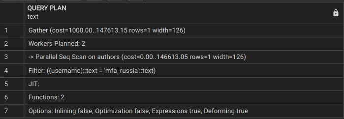

Plánovač vybral paralelný sekvenčný scan. Dôvodom je to, že úloha je svojou charakteristikou paralelizovateľná, pretože môžeme pole autorov rozdeliť do menších častí, ktoré sa prehľadajú samostatne. Tiež máme v konfiguráku nastavený počet workerov na 2, čiže Postres má dovolené spawnovať workerov, ak potrebuje.

### Úloha 2:

Na selecte pracovali 2 workery (podľa hodnoty nastavenej v konfiguráku). Ich úlohou je prehľadať rôzne časti tabuľky (teraz sa tabuľka rozdelí na 2 nezávislé časti, každý worker prehľadá jednu)

| 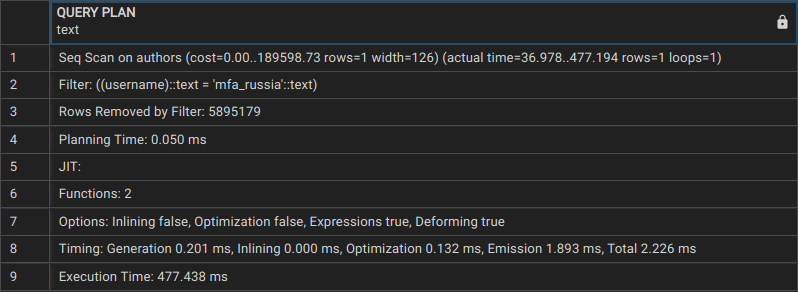 |
| :------------------------: |
|       Sekvenčný scan       |
| 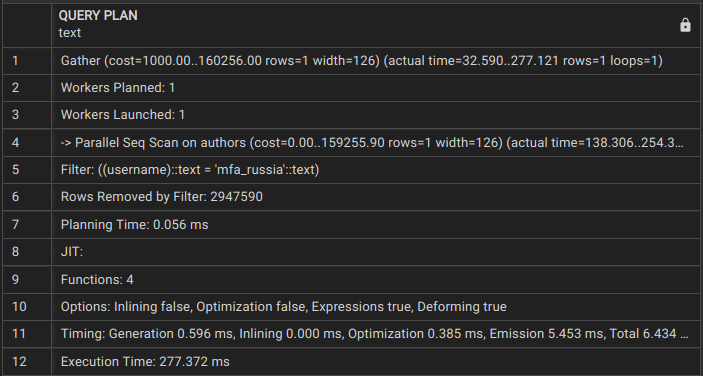 |
|          1 worker          |
|  |
|         2 workers          |
| 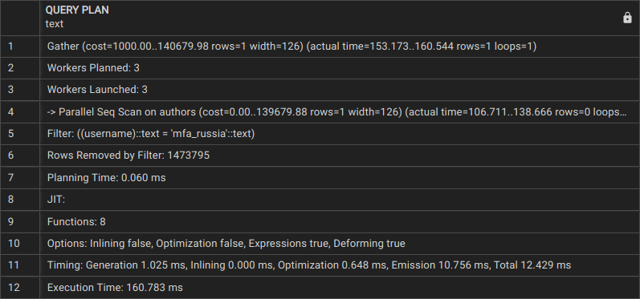 |
|         3 workers          |
|  |
|         4 workers          |
| 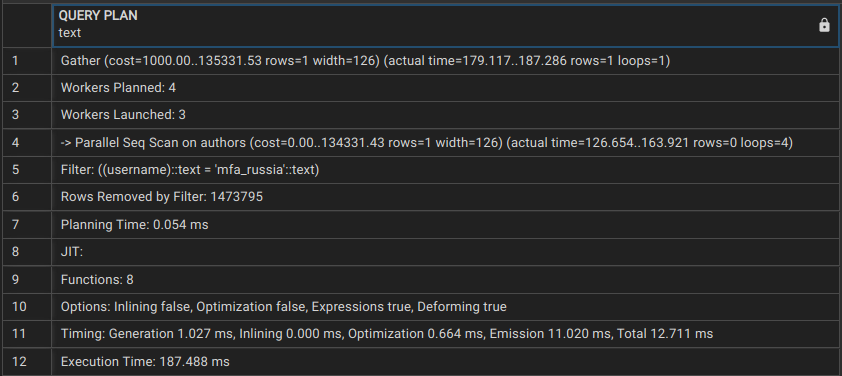 |
|         6 workers          |

Čas na vykonanie selectu klesal do momentu kým sa nám neminuli voľné CPU (máme 4). Od nastavenia počtu workerov na 4, sa nám nezmenil počet spustených workerov. Počet workerov sme nastavovali pomocou:

```SQL
set max_parallel_workers_per_gather to desired_number;
```

### Úloha 3:

Query:

```SQL
create index idx_authors_username on authors using BTREE (username);
select * from authors where username = 'mfa_russia';
```

Explain Analyze:
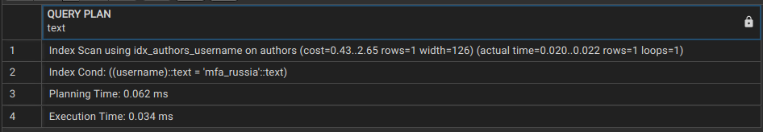

Nebolo použitých viac workerov. Zrýlechenie vyplýva z toho, že vytvorením indexu sa zmenila dátová štruktúra, v ktorej sa vyhľadáva. Teraz sa používa stromová štruktúra BTREE, ktorá má logaritmickú zložitosť, na rozdiel od scanu, ktorý je lineárny.

| 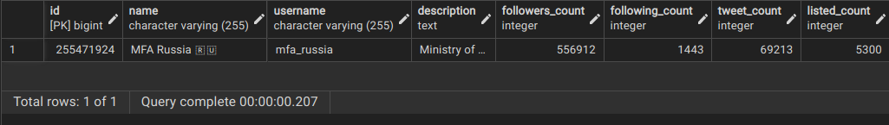 |
| :------------------------: |
|         3 workers          |
| 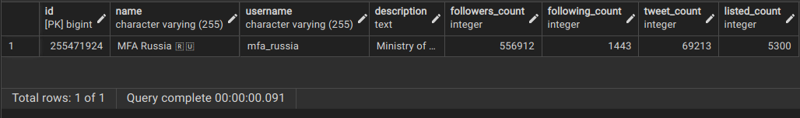 |
|        BTREE INDEX         |

Použitím indexu sme vylepšili čas približne o polovicu v porovnaní s sekvenčným scanom s 3 workermi.

### Úloha 4:

Query:

```SQL
select * from authors where followers_count between 100 and 200;
select * from authors where followers_count between 100 and 120;
```

Explain Analyze:
| 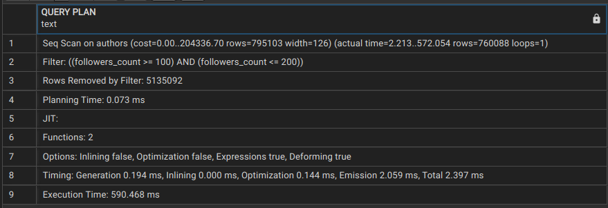 |
| :--------------------------: |
| between 100 and 200 |
| 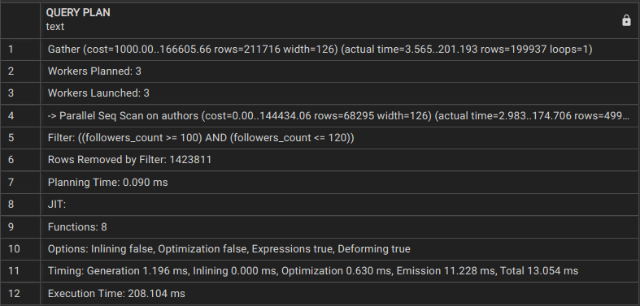 |
| between 100 and 120X |

Ako vidíme rozdiel je v tom, že ak hľadáme vačší interval, tak sa plánovač uprednostní obyčajný sekvenčný namiesto paralelného. Toto môže byť zapríčinené tým, že ako sa zvyšuje interval, tým sa zvyšuje aj cena gather operácie. Pretože paralelizácia nie je len o tom, že viac workerov => menší čas. Pri paralelizácií dochádza aj k rozdeleniu úlohy medzi workerov a komunikácie výsledkov do master procesu.

### Úloha 5:

Query:

```SQL
select * from authors where followers_count between 100 and 200;
select * from authors where followers_count between 100 and 120;
```

Index:

```SQL
create index idx_follow_interval on authors using BTREE (followers_count) where (followers_count >= 100) and (followers_count <= 200);
```

Explain Analyze:
| 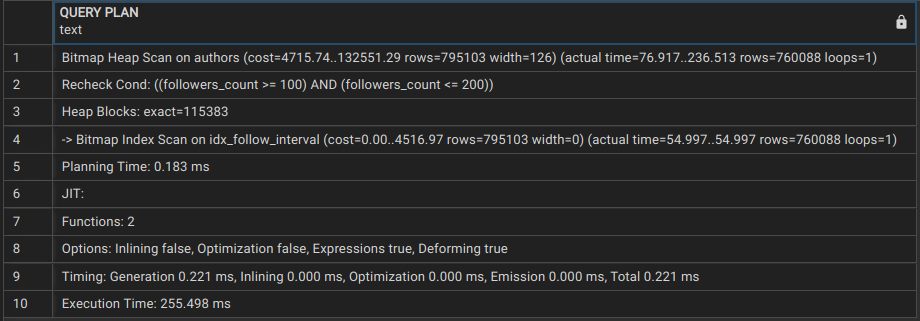 |
| :--------------------------: |
| between 100 and 200 |
| 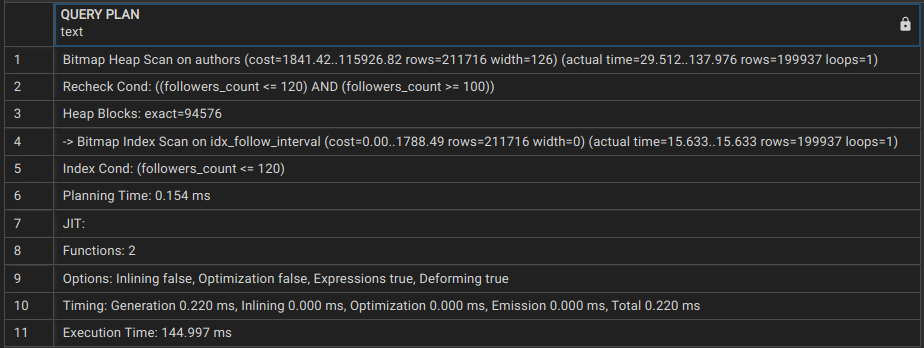 |
| between 100 and 120X |

### Úloha 6:

Query:

```SQL
insert into authors values (456168618, 'StefanHajdu', 'stevexo', 'james bond fan', 1212, 1516, 22, 565);
```

Index:

```SQL
create index idx_authors_name on authors using BTREE (name);
create index idx_authors_follow_cnt on authors using BTREE (followers_count);
create index idx_authors_desc on authors using BTREE (description);

drop index idx_follow_interval;
drop index idx_authors_name;
drop index idx_authors_follow_cnt;
drop index idx_authors_desc;
```

Porovnanie času:
| 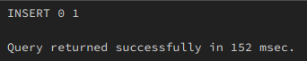 |
| :--------------------------: |
| insert do tabuľky so 4 indexami |
| 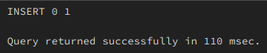 |
| insert do tabuľky bez indexov |

### Úloha 7:

Index:

```SQL
create index idx_conv_content on conversations using BTREE (content);
create index idx_conv_retweet on conversations using BTREE (retweet_count);
```

Porovnanie času:
| 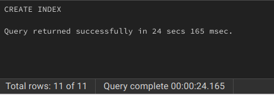 |
| :--------------------------: |
| insert do tabuľky so 4 indexami |
| 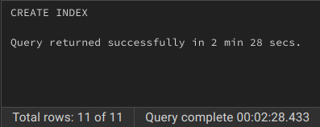 |
| insert do tabuľky bez indexov |

### Úloha 8

Query:

```SQL
create extension pgstattuple;
create extension pageinspect;

select * from pgstatindex('idx_conv_content');
select * from pgstatindex('idx_conv_retweet');
select * from pgstatindex('idx_authors_name'
select * from pgstatindex('idx_authors_follow_cnt');
```
