# Zadanie II.

| Vypracoval: | Štefan Hajdú                                                   |
| ----------- | -------------------------------------------------------------- |
| GitHub:     | https://github.com/StefanHajdu/PDT-22/tree/master/Assignment_2 |

### Úloha 1:

Query:

```SQL
select * from authors where username = 'mfa_russia';
```

Explain:


Plánovač vybral paralelný sekvenčný scan. Dôvodom je to, že úloha je svojou charakteristikou paralelizovateľná, pretože môžeme pole autorov rozdeliť do menších častí, ktoré sa prehľadajú samostatne. Tiež máme v konfiguráku nastavený počet workerov na 2, čiže Postres má dovolené spawnovať workerov, ak potrebuje.

### Úloha 2:

Na selecte pracovali 2 workery (podľa hodnoty nastavenej v konfiguráku). Ich úlohou je prehľadať rôzne časti tabuľky (teraz sa tabuľka rozdelí na 2 nezávislé časti, každý worker prehľadá jednu)

|  |
| :------------------------: |
|       Sekvenčný scan       |
|  |
|          1 worker          |
|  |
|         2 workers          |
|  |
|         3 workers          |
|  |
|         4 workers          |
|  |
|         6 workers          |

Čas na vykonanie selectu klesal do momentu kým sa nám neminuli voľné CPU (máme 4). Od nastavenia počtu workerov na 4, sa nám nezmenil počet spustených workerov. Počet workerov sme nastavovali pomocou:

```SQL
set max_parallel_workers_per_gather to desired_number;
```

### Úloha 3:

Query:

```SQL
create index idx_authors_username on authors using BTREE (username);
select * from authors where username = 'mfa_russia';
```

Explain Analyze:


Nebolo použitých viac workerov. Zrýlechenie vyplýva z toho, že vytvorením indexu sa zmenila dátová štruktúra, v ktorej sa vyhľadáva. Teraz sa používa stromová štruktúra BTREE, ktorá má logaritmickú zložitosť, na rozdiel od sekvenčného scanu, ktorý je lineárny.

|  |
| :------------------------: |
|         3 workers          |
|  |
|        BTREE INDEX         |

Použitím indexu sme vylepšili čas približne o polovicu v porovnaní s sekvenčným scanom s 3 workermi.

### Úloha 4:

Query:

```SQL
select * from authors where followers_count between 100 and 200;
select * from authors where followers_count between 100 and 120;
```

Explain Analyze:
|  |
| :--------------------------: |
| between 100 and 200 |
|  |
| between 100 and 120 |

Ako vidíme rozdiel je v tom, že ak hľadáme vačší interval, tak sa plánovač uprednostní obyčajný sekvenčný namiesto paralelného. Toto môže byť zapríčinené tým, že ako sa zvyšuje interval, tým sa zvyšuje aj cena gather operácie. Pretože paralelizácia nie je len o tom, že viac workerov => menší čas. Pri paralelizácií dochádza aj k rozdeleniu úlohy medzi workerov a komunikácie výsledkov do master procesu, ktoré tiež vyžadujú čas a výkon.

### Úloha 5:

Query:

```SQL
select * from authors where followers_count between 100 and 200;
select * from authors where followers_count between 100 and 120;
```

Index:

```SQL
create index idx_follow_interval on authors using BTREE (followers_count) where (followers_count >= 100) and (followers_count <= 200);
```

Explain Analyze:
|  |
| :--------------------------: |
| between 100 and 200 |
|  |
| between 100 and 120 |

Bitmap scany majú zmysel, ak je výstup príliš malý na sekvenčný, ale príliš veľký na index scan. Pretože oproti veľkému index scanu zmenšuje počet I/O operácií načítavania obsahu.

- Teda najprv sa prebehne celý index a zapamätá si (pomocou bitmapy) na akej stránke je hľadaný riadok uložený. Toto robí **Bitmap Index Scan**
- Potom pomocou vytorenej bitmapy vie, ktoré stránky obsahujú hľadané riadky a sekvenčne tieto stránky prehľadá. Toto robí **Bitmap Heap Scan**
- **Recheck Condition** je potrebný, aby sa dali lokalizovať hľadané riadky pri prehľadávaní stránky

### Úloha 6:

Query:

```SQL
create index idx_follow_interval on authors using BTREE (followers_count) where (followers_count >= 100) and (followers_count <= 200);
create index idx_authors_name on authors using BTREE (name);
create index idx_authors_follow_cnt on authors using BTREE (followers_count);
create index idx_authors_desc on authors using BTREE (description);

insert into authors values (456168618, 'StefanHajdu', 'stevexo', 'james bond fan', 1212, 1516, 22, 565);

drop index idx_follow_interval;
drop index idx_authors_name;
drop index idx_authors_follow_cnt;
drop index idx_authors_desc;

insert into authors values (400008618, 'StefanHajdu', 'stevexo', 'james bond fan', 1212, 1516, 22, 565);
```

Porovnanie času:
|  |
| :--------------------------: |
| insert do tabuľky so 4 indexami |
|  |
| insert do tabuľky bez indexov |

### Úloha 7:

Index:

```SQL
create index idx_conv_content on conversations using BTREE (content);
create index idx_conv_retweet on conversations using BTREE (retweet_count);
```

Porovnanie času:
|  |
| :--------------------------: |
| vytvorenie indexu pre retweet_count |
|  |
| vytvorenie indexu pre content |

Hlavným faktorom ovplyňujúcim rýchlosť vytvárania indexu je počet záznamov. V našom prípade je, ale počet záznamov rovnaký.

Pri vytváraní BTREE indexu dochádza k porovnaniu hodnôt. Dlhý text ako content sa porovnáva pomalšie ako číselné hodnoty, lebo text je nutné porovnať alfa-numericky, pričom sa prechádza po znakoch kým sa nenájde rozdiel.

Tým textové reťazce sú väčšie ako obyčajné integery do počtu bytov, tak aj index vytvorený nad nimi je väčší, teda je potrebných viac blokov v indexe, čo navyšuje aj počet vykonaných I/O operácií.

### Úloha 8

Query:

```SQL
create extension pgstattuple;
create extension pageinspect;

select tree_level, root_block_no, index_size from pgstatindex('idx_conv_content');
select tree_level, root_block_no, index_size from pgstatindex('idx_conv_retweet_cnt');
select tree_level, root_block_no, index_size from pgstatindex('idx_authors_name');
select tree_level, root_block_no, index_size from pgstatindex('idx_authors_follow_cnt');

select avg_item_size, page_size from bt_page_stats('idx_conv_content', 1000);
select avg_item_size, page_size from bt_page_stats('idx_conv_retweet_cnt', 1000);
select avg_item_size, page_size from bt_page_stats('idx_authors_name', 1000);
select avg_item_size, page_size from bt_page_stats('idx_authors_follow_cnt', 1000);
```

| 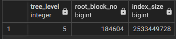  |
| :-------------------------------: |
|  |
|         idx_conv_content          |

| 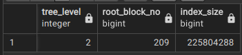  |
| :-------------------------------: |
| 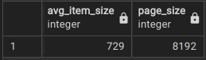 |
|         idx_conv_retweet          |

| 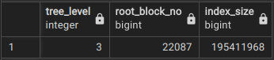  |
| :----------------------------: |
| 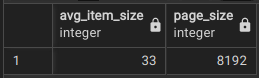 |
|        idx_authors_name        |

| 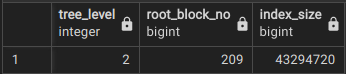  |
| :------------------------------: |
|  |
|      idx_authors_follow_cnt      |

### Úloha 9

Query:

```SQL
create index idx_conv_content on conversations using BTREE (content);
select * from conversations where content like '%Gates%';
```

Explain Analyze:

|  |
| :------------------------------: |
|    Hľadaj 'Gates' bez indexu     |
|    |
|  Hľadaj 'Gates' s BTREE indexom  |

Rozdiel v plánoch nie je žiaden, plánovač vyberie paralelný scan aj keď je vytvorený index. Čo dáva zmysel, kedže BTREE index nevie vyhľadávať podreťazce, iba prefixy, lebo text usporiada alfa-numericky.

### Úloha 10

Query:

```SQL
select * from conversations where content like 'There are no excuses%' and possibly_sensitive=true;
```

Explain Analyze:


Vytvorený BTREE index sa nepoužil. Pretože plánovač zvažuje BTREE index, keď sa má vykonať porovnanie (=, <, >, <=, =>). Nie keď chceme vyhľadávať reťazce podľa obsahu.

Ak bolo query nasledovné:

```SQL
select * from conversations where content='There are no excuses' and possibly_sensitive=true;
```

Explain Analyze:

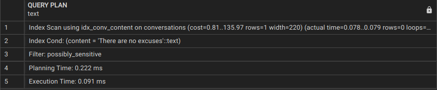

Potom by sa použil index scan, ale takto sa text vyhľadávať nedá.

Zefektívniť vyhľadávanie môžeme vytvorením GIN indexu nad typom trigram. Hoci toto by trochu overkill.

Alebo vytvoriť BTREE nad inou sadou operátorov (varchar_pattern_ops), čím sa umožní vyhľadávanie prefixov pomocou LIKE:

```SQL
create index idx_content_prefix ON conversations using BTREE (content varchar_pattern_ops);
```

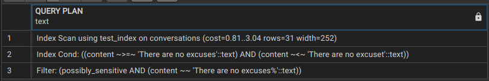

### Úloha 11

Query:

```SQL
create index idx_conv_content_url on conversations using BTREE
(lower(right(content, length('https://t.co/pkFwLXZlEm'))));

select * from conversations where
lower(right(content, length('https://t.co/pkFwLXZlEm'))) = lower('https://t.co/pkFwLXZlEm');
```

Explain Analyze:


BTREE sa aktivuje ak hľadáme podľa porovnania, preto zaindexujeme posledných N znakov (N je dĺžka reťazca 'https://t.co/pkFwLXZlEm'). Ak chceme aby výsledok nebol závislý od veľkosti znakov vstupu prevedieme indexovaný text na lowercase. Následne budeme podľa rovnakej podmienky aj vyhľadávať, teda hľadáme také záznamy, ktoré majú posledných N znakov **rovných** 'https://t.co/pkfwlxzlem'.

Použité funkcie:

- lower(): zmena vstupu na lowercase, podmienka nezávislosti vstupu
- right(): extrahovanie posledných N znakov z textu
- length(): vráti dĺžku reťazca

Výsledok:


### Úloha 12

Query:

```SQL
create index idx_conv_reply_cnt on conversations using BTREE (reply_count);
create index idx_conv_retweet_cnt on conversations using BTREE (retweet_count);
create index idx_conv_quote_cnt on conversations using BTREE (quote_count);

select * from conversations where reply_count > 150 and retweet_count >= 5000
order by quote_count desc;
```

Explain Analyze:

|  |
| :-------------------------------: |
|            Bez indexov            |

|  |
| :--------------------------------: |
|   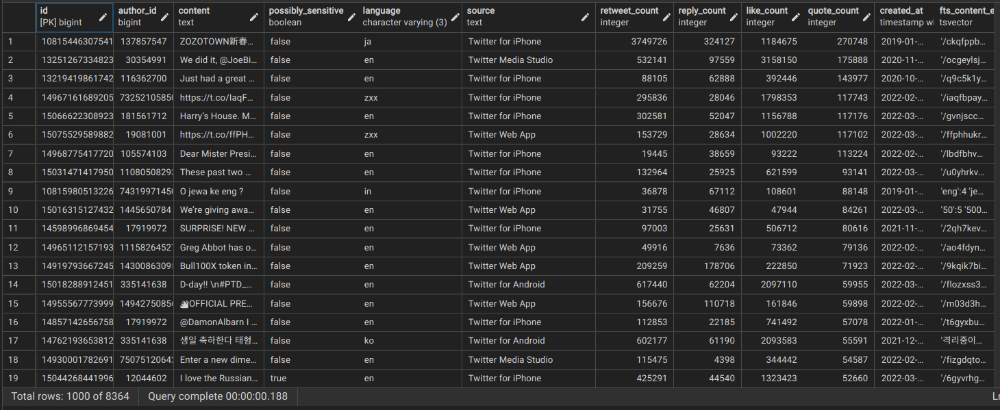    |
|             S indexami             |

Ukázalo sa, že sa používa jediný index scan, a to nad stĺpcom reply_count. Ktorým sa získajú záznamy s reply_count > 150. Ďaľšia časť podmienky už nie je riešená cez index, ale cez klasický filter. Pravdepodobne prvý index scan zredukuje množinu až tak, že ďaľší index scan nie je nutný. Pre toto konkrétne query nie je potrebné držať indexy pre retweet_count a quote_count.

### Úloha 13

Query:

```SQL
create index idx_conv_metrics on conversations using btree (reply_count, retweet_count, quote_count);

select * from conversations where reply_count > 150 and retweet_count >= 5000
order by quote_count desc;
```

Explain Analyze:

|   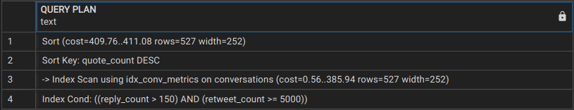   |
| :---------------------------: |
| 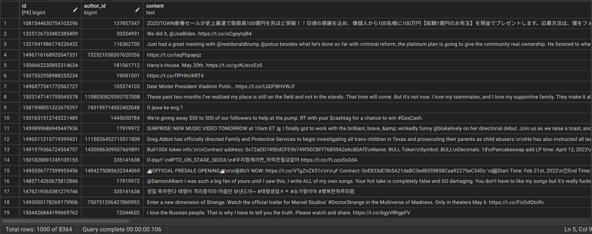 |
|         Zložený index         |

### Úloha 14

Query:

```SQL
-- create ts_vector column
alter table conversations
	add column fts_content_eng tsvector
		generated always as (to_tsvector('english', coalesce(content,''))) stored;

-- create index
create index idx_content_gin on conversations using gin (fts_content_eng);
create index idx_content_gist on conversations using gist (fts_content_eng);

-- search
select
	*
from
	conversations
where
	fts_content_eng @@ to_tsquery('english', 'Putin & New <-> World <-> Order') and possibly_sensitive=true;
```

Explain Analyze + Výsledky:

|   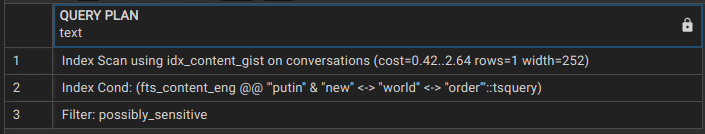   |
| :------------------------------------: |
| 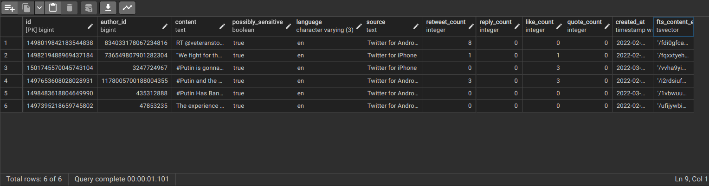 |
|         Vytvorený GiST aj GIN          |

|   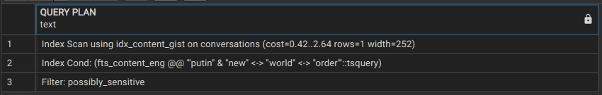   |
| :--------------------------------: |
| 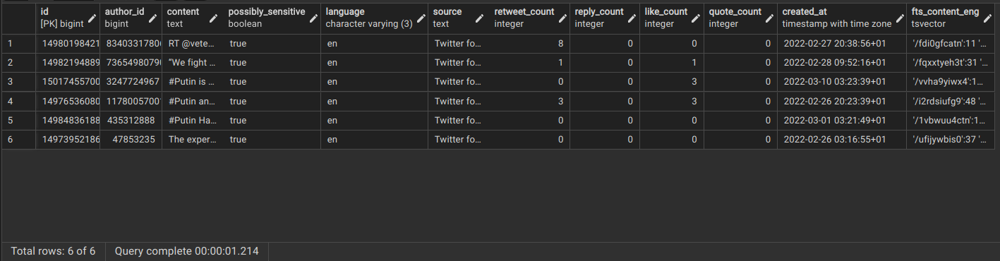 |
|         Vytvorený iba GiST         |

|   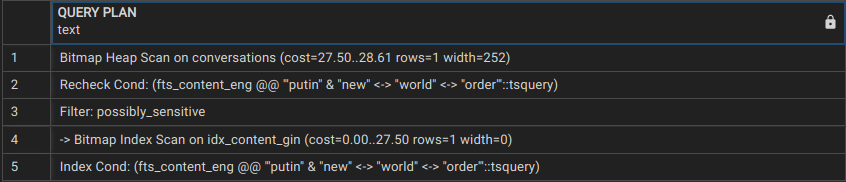   |
| :-------------------------------: |
| 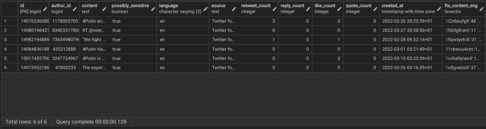 |
|         Vytvorený iba GIN         |

Vyhľadávanie nad GIN je efektívnejšie. Aj napriek tomu, že riešené cez Bitmap Heap Scan a nie cez priamy index scan ako GIST. Ukázalo sa, že až je 10-krát rýchlejšie v porovnaní s GIST-om. Tiež sa nám GIN vytvoril rýchlejšie ako GIST (8 min vs 30 min).

### Úloha 15

Query:

```SQL
create index idx_urls_trgm on links using gin (url gin_trgm_ops);
select * from links where url like '%darujme.sk%';
```

Explain Analyze + Výsledky:

|   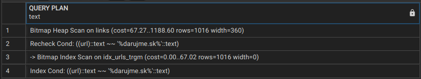   |
| :---------------------------: |
| 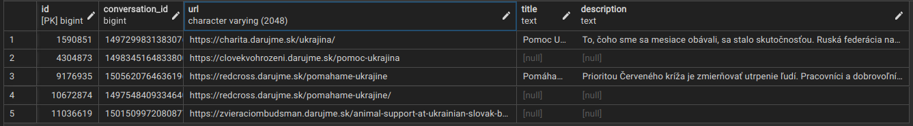 |
|     Vytvorený GiST aj GIN     |

Správnou voľbou je vytvorenie GIN indexu nad trigramami vytvorenými z url. V tejto úlohe sa nepozeráme na text z pohľadu FTS, teda nepotrebujeme tokeny. Potrebujeme aby sme vedeli rýchlo vyhľadávať podreťazce pomocou LIKE, na to sú trigrami najvhodnejší typ.

### Úloha 16

Indexy:

```SQL
alter table authors
	add column fts_username_eng tsvector
		generated always as (to_tsvector('english', coalesce(username,''))) stored;

alter table authors
	add column fts_description_eng tsvector
		generated always as (to_tsvector('english', coalesce(description,''))) stored;

alter table conversations
	add column fts_content_eng tsvector
		generated always as (to_tsvector('english', coalesce(content,''))) stored;


create index idx_content_gin on conversations using gin (fts_content_eng);
create index idx_username_gin on authors using gin (fts_username_eng);
create index idx_description_gin on authors using gin (fts_description_eng);

create index idx_author_id on authors using btree(id);
create index idx_conv_id on conversations using btree(author_id);
```

Query AND:

```SQL
select
	authors.username, authors.description, conversations.content, conversations.retweet_count
from
	conversations
inner join
	authors
on
	conversations.author_id = authors.id
where
	conversations.fts_content_eng @@ to_tsquery('english', 'Володимир & Президент') and
	to_tsvector('english', authors.username) @@ to_tsquery('english', 'Володимир & Президент') and
	to_tsvector('english', authors.description) @@ to_tsquery('english', 'Володимир & Президент')
order by
	retweet_count desc;
```

Explain:

| 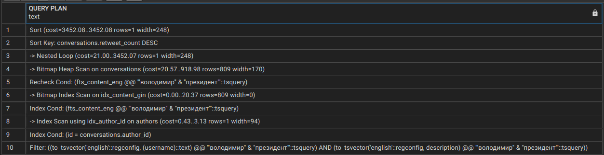 |
| :---------------------------: |
|           JOIN AND            |

Query OR:

```SQL
select
	authors.username, authors.description, conversations.content, conversations.retweet_count
from
	conversations
inner join
	authors
on
	conversations.author_id = authors.id
where
	conversations.fts_content_eng @@ to_tsquery('english', 'Володимир & Президент') or
	to_tsvector('english', authors.username) @@ to_tsquery('english', 'Володимир & Президент') or
	to_tsvector('english', authors.description) @@ to_tsquery('english', 'Володимир & Президент')
order by
	retweet_count desc;
```

Explain:

| 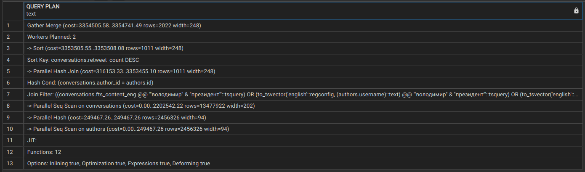 |
| :--------------------------: |
|           JOIN OR            |

Výsledné query:

```SQL
	select
		authors.username, authors.description, conversations.content, conversations.retweet_count
	from
		conversations
	inner join
		authors
	on
		conversations.author_id = authors.id
	where
		conversations.fts_content_eng @@ to_tsquery('english', 'Володимир & Президент')
union
	select
		authors.username, authors.description, conversations.content, conversations.retweet_count
	from
		conversations
	inner join
		authors
	on
		conversations.author_id = authors.id
	where
		authors.fts_description_eng @@ to_tsquery('english', 'Володимир & Президент')
union
	select
		authors.username, authors.description, conversations.content, conversations.retweet_count
	from
		conversations
	inner join
		authors
	on
		conversations.author_id = authors.id
	where
		authors.fts_username_eng @@ to_tsquery('english', 'Володимир & Президент')
order by
	retweet_count desc;
```

Explain + Výsledok:

| 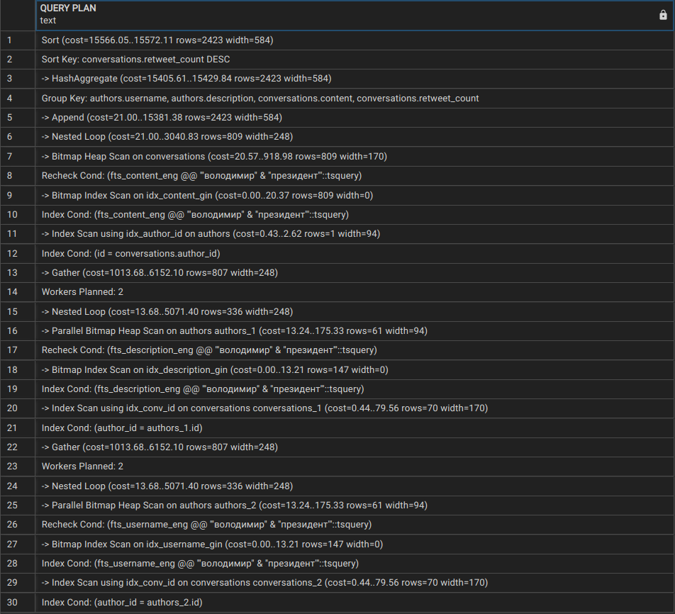 |
| :--------------------------------: |
|   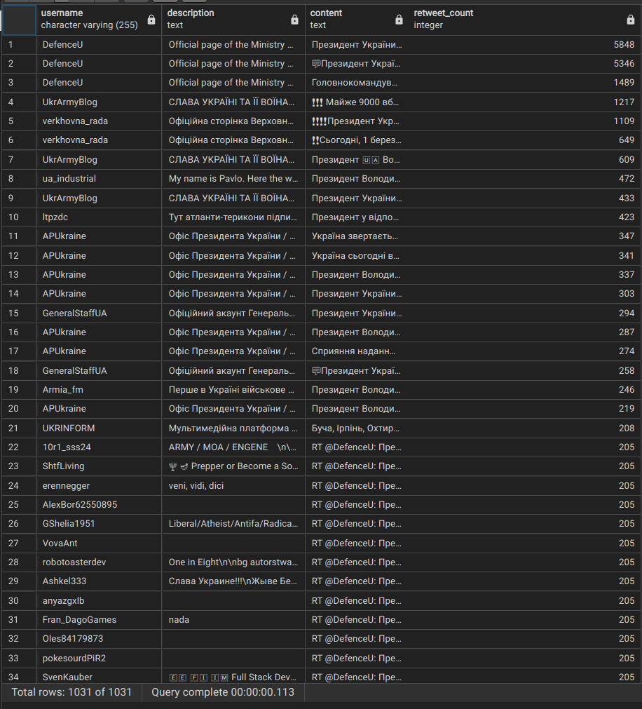    |
|          Najlepšie query           |
