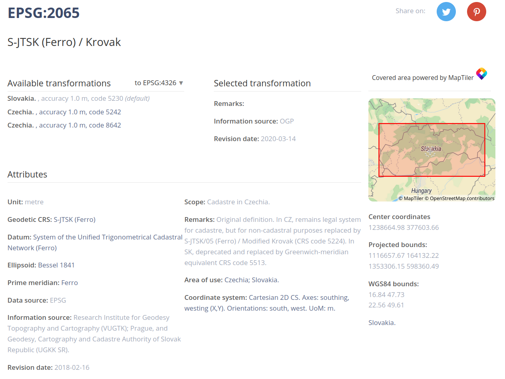
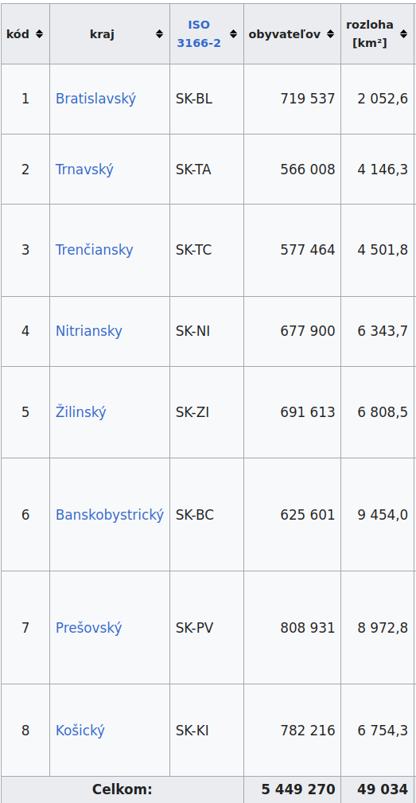
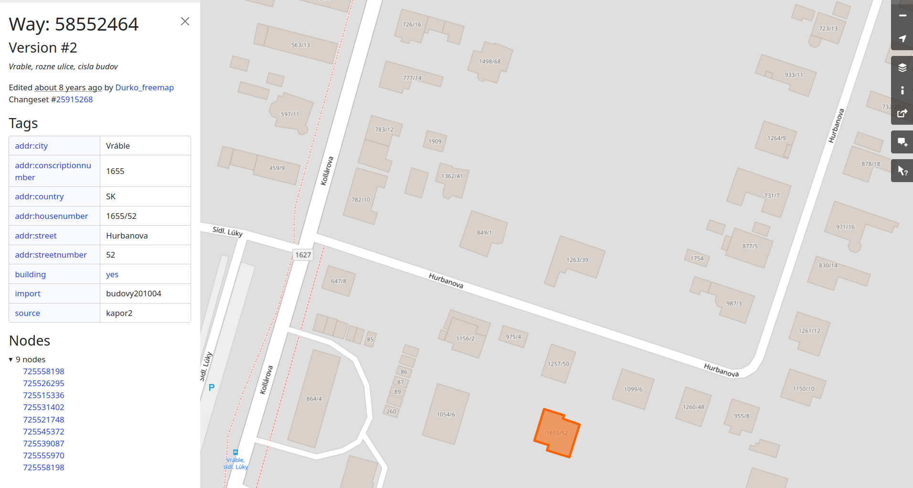
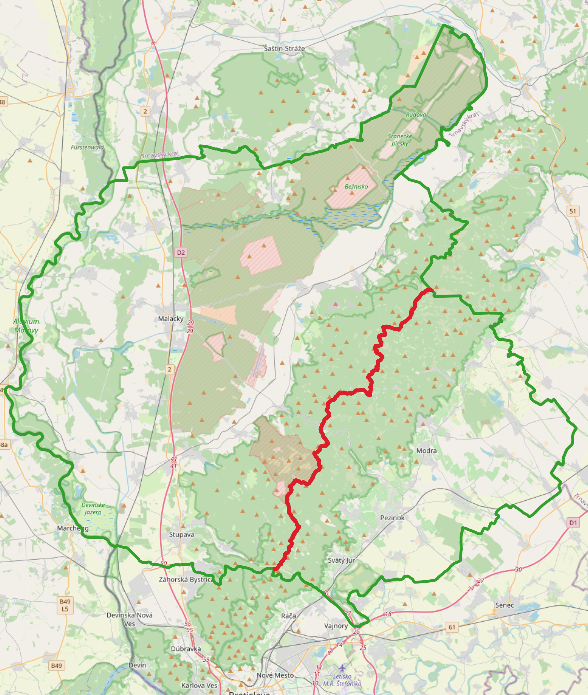
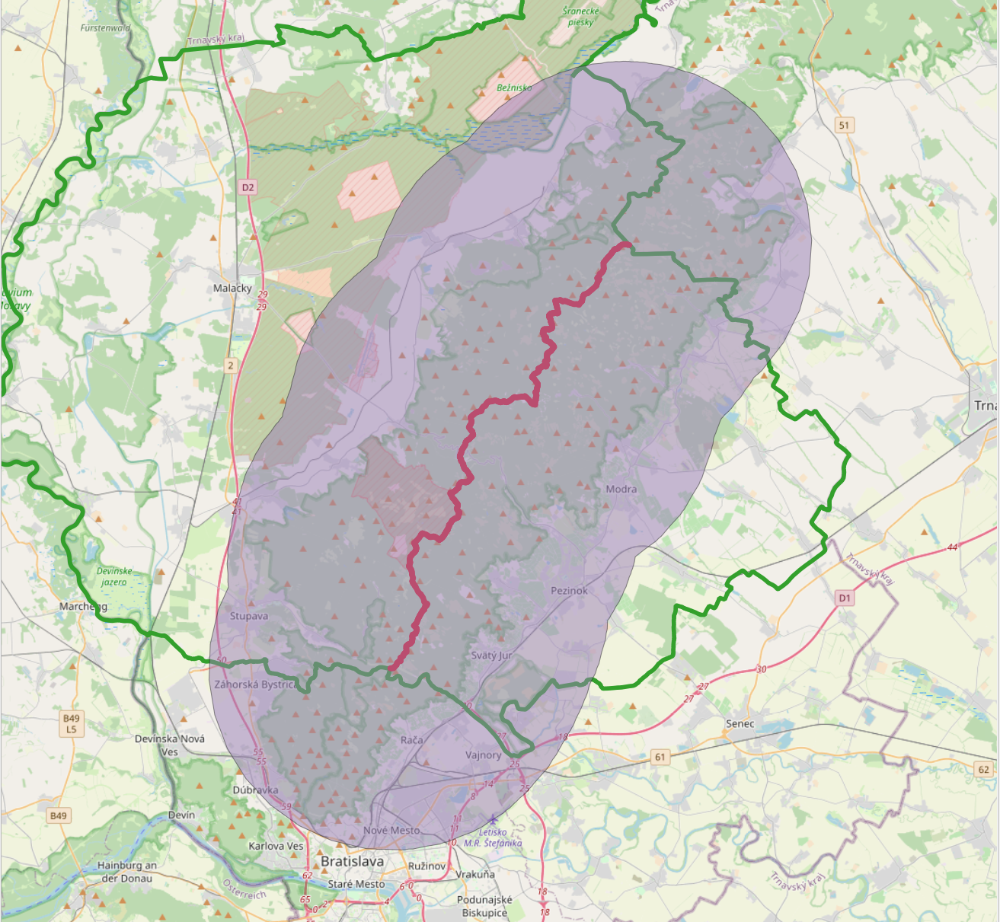
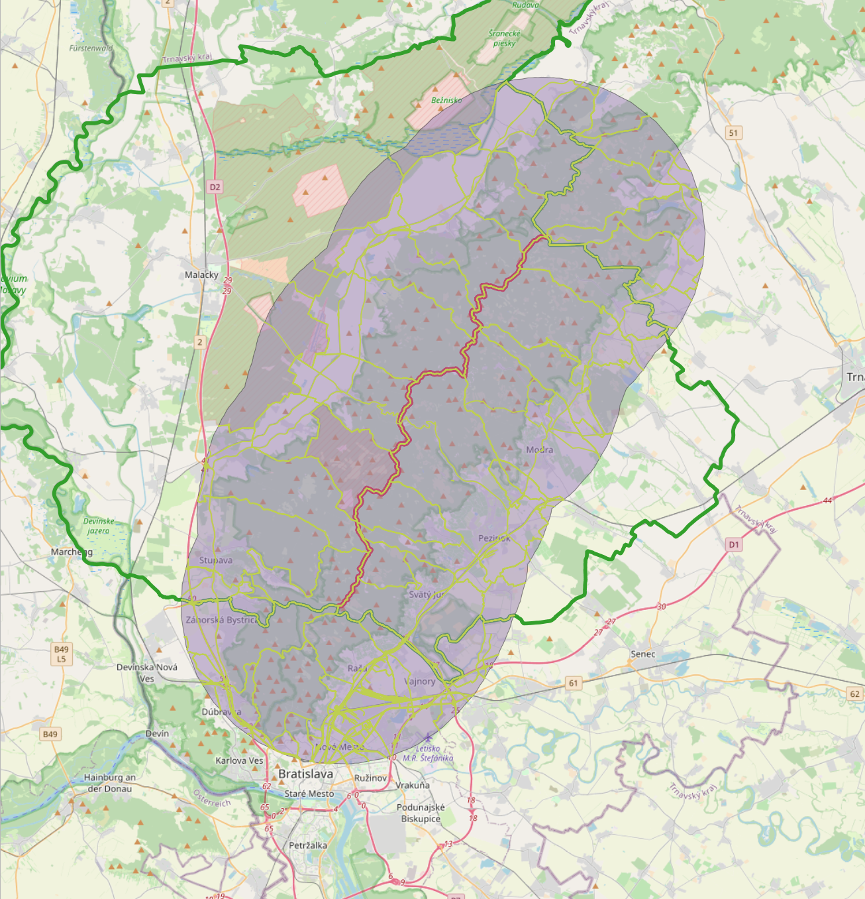
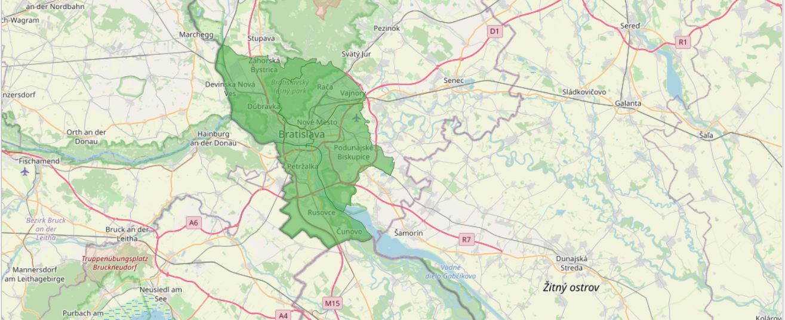
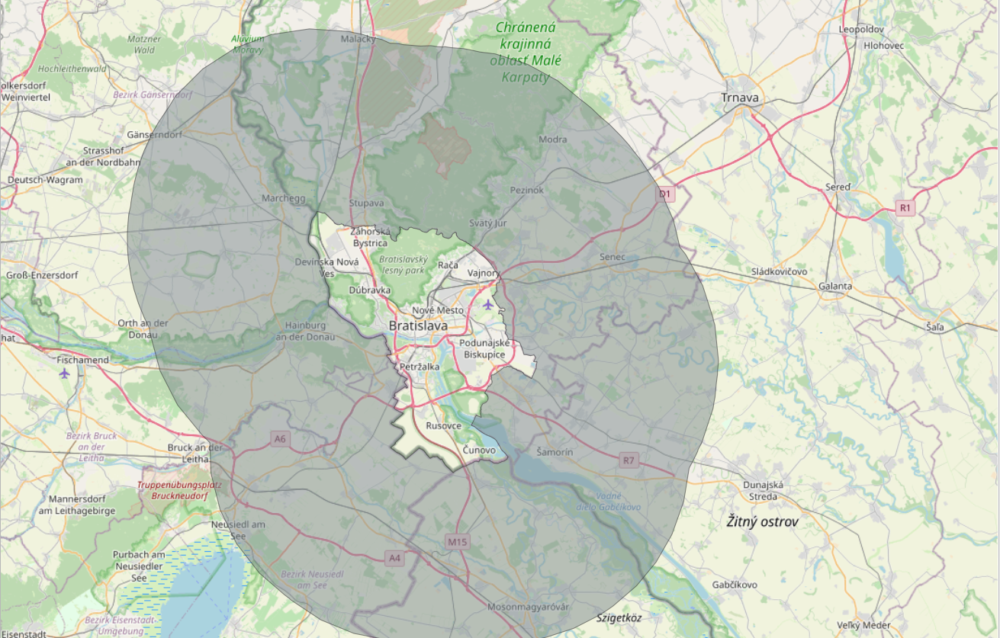
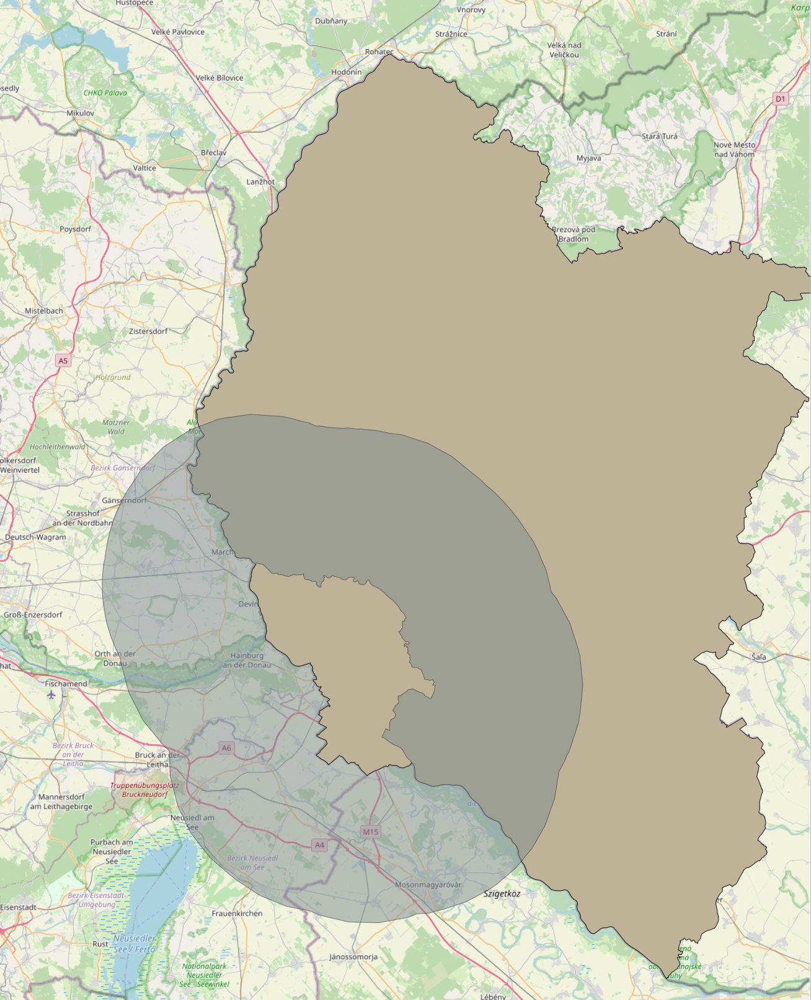
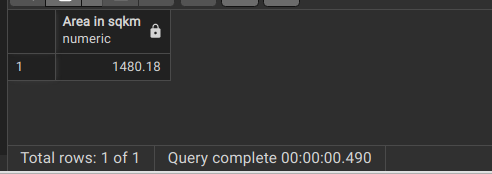

# Zadanie III.

| Vypracoval: | Štefan Hajdú                                                   |
| ----------- | -------------------------------------------------------------- |
| GitHub:     | https://github.com/StefanHajdu/PDT-22/tree/master/Assignment_3 |

## Úloha 1:

Dáta sme importovali pomocou balíka `osm2pgsql`. Balíček je odpoúčaný dokumentáciou (https://wiki.openstreetmap.org/wiki/Osm2pgsql):

_"Osm2pgsql is a software to import OpenStreetMap data into a PostgreSQL/PostGIS database."_

```
osm2pgsql -U postgres -W -d svk_postgis -H localhost -C 1000 --number-processes 4  ../data/slovakia-latest.osm.pbf
```

Output:

```
2022-10-25 17:12:02  osm2pgsql version 1.6.0
Password:
2022-10-25 17:12:06  Database version: 14.5 (Ubuntu 14.5-0ubuntu0.22.04.1)
2022-10-25 17:12:06  PostGIS version: 3.2
2022-10-25 17:12:06  Setting up table 'planet_osm_point'
2022-10-25 17:12:06  Setting up table 'planet_osm_line'
2022-10-25 17:12:06  Setting up table 'planet_osm_polygon'
2022-10-25 17:12:06  Setting up table 'planet_osm_roads'
2022-10-25 17:13:01  Reading input files done in 55s.
2022-10-25 17:13:01  Processed 27341865 nodes in 3s - 9114k/s
2022-10-25 17:13:01  Processed 3567295 ways in 42s - 85k/s
2022-10-25 17:13:01  Processed 45711 relations in 10s - 5k/s
2022-10-25 17:13:03  Clustering table 'planet_osm_point' by geometry...
2022-10-25 17:13:03  Clustering table 'planet_osm_line' by geometry...
2022-10-25 17:13:03  Clustering table 'planet_osm_polygon' by geometry...
2022-10-25 17:13:03  Clustering table 'planet_osm_roads' by geometry...
2022-10-25 17:13:08  Creating geometry index on table 'planet_osm_point'...
2022-10-25 17:13:08  Creating geometry index on table 'planet_osm_roads'...
2022-10-25 17:13:09  Analyzing table 'planet_osm_roads'...
2022-10-25 17:13:16  Analyzing table 'planet_osm_point'...
2022-10-25 17:13:16  Creating geometry index on table 'planet_osm_line'...
2022-10-25 17:13:16  All postprocessing on table 'planet_osm_point' done in 12s.
2022-10-25 17:13:20  Creating geometry index on table 'planet_osm_polygon'...
2022-10-25 17:13:28  Analyzing table 'planet_osm_line'...
2022-10-25 17:13:29  All postprocessing on table 'planet_osm_line' done in 25s.
2022-10-25 17:14:04  Analyzing table 'planet_osm_polygon'...
2022-10-25 17:14:05  All postprocessing on table 'planet_osm_polygon' done in 61s (1m 1s).
2022-10-25 17:14:05  All postprocessing on table 'planet_osm_roads' done in 5s.
2022-10-25 17:14:05  osm2pgsql took 119s (1m 59s) overall.
```

---

## Úloha 2:

Riadky filtrujeme podľa `admin_level='4'`. Zobrazíme súradnice bodov (vo formáte longtitude/latitude; EPSG 4326), ktoré tvoria polygón každého z krajov.

```SQL
SELECT
    name,
    ST_AsText(
        ST_Transform(way, 4326)
    )
FROM
    planet_osm_polygon
WHERE
    admin_level='4';
```


---

## Úloha 3:

Keďže treba počítať polchu v km^2, tak potrebujeme súradnicový systém v metroch. Okrem toho treba, aby čo najlepšie popisoval danú oblasť.

Pomocou stránky https://epsg.io/?q=slovakia sme našli systém, ktorý nám vyhovuje:



Pomocou funkcie `ST_Area` vypočítame plochy každého polygónu kraja v km^2.

Pre porovnanie počítame rozlohu aj pomocou typu `geography` vypočítaného zo súradnicového systému EPSG 4326.

```SQL
SELECT
    name,
	round(
        (ST_Area(
		    ST_Transform(way, 2065)) / 1000000)::numeric, 2
    ) as "Area in sqkm (EPSG 2065)",
	round(
        (ST_Area(
		    ST_Transform(way, 4326)::geography) / 1000000)::numeric, 2
    ) as "Area in sqkm (EPSG 4326)"
FROM
    planet_osm_polygon
WHERE
    admin_level='4'
ORDER BY
    "Area in sqkm (EPSG 2065)";
```

Naše výsledky:


Rozloha počítaná pomocou `geography` je takmer rovnaká ako počítaná pomocou dedikovaného súradnicového systému pre Slovensko.

Oficiálne výsledky (https://sk.wikipedia.org/wiki/Zoznam_krajov_na_Slovensku):



---

## Úloha 4:

Body polygónu našho domu sme našli na pomocou https://www.openstreetmap.org/way/58552464#map=19/48.24430/18.31037.



10 bodov uzatvoreného polygónu sme zadali v EPSG 4326, keďže zadávame stupne. A previedli ich na EPSG 3857, lebo v tomto systéme sú ostatné záznamy v tabuľke.

```SQL
INSERT INTO
	planet_osm_polygon ("addr:housename", "addr:housenumber", way)
VALUES
(
	'StefanReallyRealHome',
	'1655/52',
	ST_Transform(
		ST_GeomFromText(
			'POLYGON((
				18.3104035 48.2443337,
				18.3103985 48.2443232,
				18.3104750 48.2443061,
				18.3104265 48.2442041,
				18.3103236 48.2442253,
				18.3103302 48.2442404,
				18.3102629 48.2442545,
				18.3103097 48.2443532,
				18.3104035 48.2443337))',
			4326
		), 3857
	)
);

SELECT
    "addr:housename",
    "addr:housenumber",
    ST_AsText(way),
	ST_SRID(way),
    way
FROM
    planet_osm_polygon
WHERE
    "addr:housename"='StefanReallyRealHome';
```

Dom sa uložil správne. Polohy súhlasia.


---

## Úloha 5:

Krajskú príslušnosť zistíme pomocou funkcie `ST_Contains`, ktorá vráti TRUE, ak prvý parameter obsahuje druhý parameter. V našom prípade je prvý parameter polygón každého z krajov a druhý je polygón nášho domu.

```SQL
SELECT
	name
FROM
	planet_osm_polygon
WHERE
	admin_level='4' AND
	ST_Contains
	(
		way,
		(
			SELECT
				way
			FROM
				planet_osm_polygon
			WHERE
				"addr:housename"='StefanReallyRealHome'
		)
	)=TRUE;
```

Keďže bývame vo Vrábľoch, ktoré sú v Nitrianskom okrese, tak query funguje správne.


---

## Úloha 6:

Aktuálny bod našej polohy sme našli na pomocou https://my-location.org/.
Bod sme zadali v EPSG 4326, keďže zadávame stupne. A previedli ho na EPSG 3857, lebo v tomto systéme sú ostatné záznamy v tabuľke.

```SQL
INSERT INTO
	planet_osm_point (name, place, way)
VALUES
(
	'StefanPositionNow',
	'HomeVrable',
	ST_Transform(
		ST_GeomFromText(
			'POINT(18.3103476 48.2443268)', 4326
		), 3857
	)
);
```

Sme doma:


---

## Úloha 7:

Vyžijeme priestorový JOIN na funkcii `ST_Contain`, teda JOIN nám spojí tie body, ktoré obsahujú polygón nášho domu.

**Sme doma**, ak query vráti riadok, ktorý má v stĺpci `housename` hodnotu `StefanReallyRealHome`

```SQL
SELECT
	osm_polygon."addr:housename" as housename,
	osm_point.name as pointname
FROM
	planet_osm_point as osm_point
JOIN
	planet_osm_polygon as osm_polygon
ON
	ST_Contains(osm_polygon.way, osm_point.way)
WHERE
	osm_point.name='StefanPositionNow' AND osm_polygon."addr:housename"='StefanReallyRealHome';
```

A naozaj sme boli doma:


---

## Úloha 8:

V tejto úlohe meriame vzdialenosť v troch súradnicových systémoch:

1. **Typ geography**: tento typ uvažuje aj so zakrivením Zeme, teda by mal byť na meranie vzdialeností napresnejší. Doporučuje to aj dokumnetácia (https://postgis.net/workshops/postgis-intro/geography.html):

   _"In order to calculate a meaningful distance, we must treat geographic coordinates not as approximate Cartesian coordinates but rather as true spherical coordinates. We must measure the distances between points as true paths over a sphere – a portion of a great circle. PostGIS provides this functionality through the geography type."_

2. **Typ geometry v súradnicovom systéme EPSG 2065**: hoci geometry počíta vzdialenosť v rovine, použitím dedikovaného súradnicového systému pre Slovensko dostaneme presný výsledok.

3. **Typ geometry počítaný na guly**: tento výpočet sa neukázal ako presný, ale skúsili sme.

```SQL
SELECT round(
			(ST_Distance(ST_Transform(planet_osm_point.way, 4326)::geography,
					   (SELECT
						ST_Transform(planet_osm_polygon.way, 4326)::geography
					   FROM
						planet_osm_polygon
					   WHERE
						name= 'Fakulta informatiky a informačných technológií STU'))::numeric)/1000, 2) AS "Distance - Geography (km)",
		round(
			(ST_Distance(ST_Transform(planet_osm_point.way, 2065),
					   (SELECT
						ST_Transform(planet_osm_polygon.way, 2065)
					   FROM
						planet_osm_polygon
					   WHERE
						name= 'Fakulta informatiky a informačných technológií STU'))::numeric)/1000, 2) AS "Distance - Geometry (km)",
		round(
			(ST_DistanceSphere(ST_Transform(planet_osm_point.way, 4326),
					   (SELECT
						ST_Transform(planet_osm_polygon.way, 4326)
					   FROM
						planet_osm_polygon
					   WHERE
						name= 'Fakulta informatiky a informačných technológií STU'))::numeric)/1000, 2) AS "Distance - Geometry on Sphere (km)"
FROM
	planet_osm_point
WHERE
	planet_osm_point.name='StefanPositionNow';
```

Výsledky:


Pre porovnanie, vzdialenosti merané pomocou:

- Google Maps : 92.37 km

- https://map.meurisse.org/ : 92.618 km

---

## Úloha 9:

QGIS sme použili na vizualizácie aj v úlohách 4. a 6.

Modrý bod označuje aktuálnu polohu, pre lepšiu orientáciu.

Kraje + Poloha v QGIS:


Domovina v QGIS:


---

## Úloha 10:

Najprv si zoradíme všetky kraje podľa veľkosti plochy (plochu počítame v EPSG 2065).
Najmenší kraj je Bratislavský.

```SQL
SELECT
	ST_AsText
	(
		ST_Centroid(g.ST_Transform)
	) as coordinates,
	ST_SRID(g.ST_Transform) as EPSG_ID
FROM
	(
		SELECT
			ST_Transform
			(
				way, 4326
			)
		FROM
			planet_osm_polygon
		WHERE
			admin_level='4'
		ORDER BY
			round(
				(ST_Area(
					ST_Transform(way, 2065)) / 1000000)::numeric, 2
			)
		LIMIT 1
	)as g
```

Výsledok v súradniciach ukazujeme v EPSG 4326, keďže chceme súradnice a tie sú najlepšie pochopiteľné vo formáte longtitude/latitude.


Na mape je použitý EPSG 3857, aby sme zachovali súlad súranicových systémov (podkladová mapa je OpenStreetMap teda je v EPSG 3857):


---

## Úloha 11

Najprv vytvoríme prienik pomocou `ST_Intersection` bodov Malackého a Pezinského okresu. Tým dostaneme body, ktoré ležia na hranici (červenou).



Tieto body prevedieme do súradnicového systému pre oblasť Slovenska EPSG 2065. Aby sme mohli vytvoriť obalovú zónu (`ST_Buffer`), ktorá naozaj zodpovedá 10 km.



Následene urobíme prienik tejto obalovej zóny s geometry objektami z tabuľky `planet_osm_roads`. Tým by sme mali dostať sieť všetkých bodov, ktoré sú považované za cestu a pritom sú v želanom perimetri.



Potom už len odfiltrujeme tie úseky, ktoré nie sú určené pre motorové vozidlá. Zdroj (https://wiki.openstreetmap.org/wiki/Key:highway) uvádza, že cesty vhodné pre motorové vozidlá sú definované hodnotami:

- motorway
- trunk
- primary
- secondary
- tertiary


Potom už len pomocou `CREATE TABLE roads_10km_malacky_pezinok_border AS` z výsledku urobíme tabuľku v DB.

```SQL
CREATE TABLE roads_10km_malacky_pezinok_border AS
	SELECT
		ST_Intersection
		(
			way,
			(
				SELECT
					ST_Transform(
						ST_Buffer(border, 10000), 3857
					)
				FROM
					ST_Transform(
							ST_Intersection(
								(
									SELECT
										way
									FROM
										planet_osm_polygon
									WHERE
										name='okres Malacky'
								),
								(
									SELECT
										way
									FROM
										planet_osm_polygon
									WHERE
										name='okres Pezinok'
								)
							), 2065
				) as border
			)
		)
	FROM
		planet_osm_roads
	WHERE
		highway IN ('motorway', 'trunk', 'primary', 'secondary', 'tertiary')
```

---

## Uloha 12

:\_(

---

## Uloha 13

Atribúty `admin_level='6' AND name='Bratislava` pokrývajú oblasť Bratislavy (okresy Bratilava I až V).



Nad touto plochou vytvoríme pomocou `ST_Buffer` obalovú plochu s polomerom 20 000 metrov. Obalovú plochu počítame v EPSG 2065, aby sme zachovali správne hodnoty vzdialeností. Následne ju prevedieme naspäť na EPSG 3857, aby sme vedeli výsledok vizualizovať a tiež preto, aby do funkcie rozdielu vstupovali rovnaké súradnicové systémy. Od tejto plochy odčítame plochu Bratislavy (`ST_Difference`).



Vytvoríme prienik bodov pomocou `ST_Intersection` obalovej plochy s plochou, ktorá vznikne zjednotením (`ST_Union`) plochy Bratislavkého a Trnavského kraja. Tým máme zaručené, že `Bratislava_Okolie` bude iba na Slovenku.




Potom už len vypočítame veľkosť plochy pomocou `ST_Area`, v súradnicovom systéme pre oblasť Slovenska EPSG 2065.



```SQL
SELECT
	round(
        	(ST_Area(
				ST_Transform(
					Bratislava_Okolie.ST_Intersection, 2065)
				) / 1000000
			)::numeric, 2
    ) as "Area in sqkm"
FROM
(
	SELECT
		ST_Intersection
		(
			ST_Difference
			(
				ST_Transform
				(
					ST_Buffer
					(
						ST_Transform(way, 2065),
						20000
					),
					3857
				),
				way
			),
			(
				SELECT
					ST_Union(way)
				FROM
					planet_osm_polygon
				WHERE
					admin_level='4' AND (name='Bratislavský kraj' OR name='Trnavský kraj')
			)
		)
	FROM
		planet_osm_polygon
	WHERE
		admin_level='6' AND name='Bratislava'
)
AS
	Bratislava_Okolie;
```
