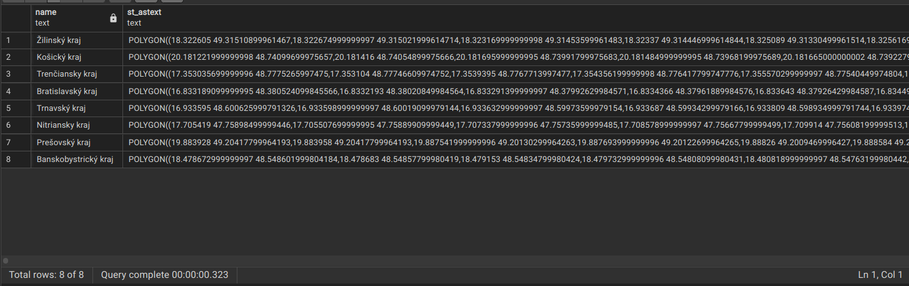

# Zadanie III.

| Vypracoval: | Štefan Hajdú                                                   |
| ----------- | -------------------------------------------------------------- |
| GitHub:     | https://github.com/StefanHajdu/PDT-22/tree/master/Assignment_3 |

## Úloha 1:

```
osm2pgsql -U postgres -W -d svk_postgis -H localhost -C 1000 --number-processes 4  ../data/slovakia-latest.osm.pbf
```

Output:

```
2022-10-25 17:12:02  osm2pgsql version 1.6.0
Password:
2022-10-25 17:12:06  Database version: 14.5 (Ubuntu 14.5-0ubuntu0.22.04.1)
2022-10-25 17:12:06  PostGIS version: 3.2
2022-10-25 17:12:06  Setting up table 'planet_osm_point'
2022-10-25 17:12:06  Setting up table 'planet_osm_line'
2022-10-25 17:12:06  Setting up table 'planet_osm_polygon'
2022-10-25 17:12:06  Setting up table 'planet_osm_roads'
2022-10-25 17:13:01  Reading input files done in 55s.
2022-10-25 17:13:01  Processed 27341865 nodes in 3s - 9114k/s
2022-10-25 17:13:01  Processed 3567295 ways in 42s - 85k/s
2022-10-25 17:13:01  Processed 45711 relations in 10s - 5k/s
2022-10-25 17:13:03  Clustering table 'planet_osm_point' by geometry...
2022-10-25 17:13:03  Clustering table 'planet_osm_line' by geometry...
2022-10-25 17:13:03  Clustering table 'planet_osm_polygon' by geometry...
2022-10-25 17:13:03  Clustering table 'planet_osm_roads' by geometry...
2022-10-25 17:13:08  Creating geometry index on table 'planet_osm_point'...
2022-10-25 17:13:08  Creating geometry index on table 'planet_osm_roads'...
2022-10-25 17:13:09  Analyzing table 'planet_osm_roads'...
2022-10-25 17:13:16  Analyzing table 'planet_osm_point'...
2022-10-25 17:13:16  Creating geometry index on table 'planet_osm_line'...
2022-10-25 17:13:16  All postprocessing on table 'planet_osm_point' done in 12s.
2022-10-25 17:13:20  Creating geometry index on table 'planet_osm_polygon'...
2022-10-25 17:13:28  Analyzing table 'planet_osm_line'...
2022-10-25 17:13:29  All postprocessing on table 'planet_osm_line' done in 25s.
2022-10-25 17:14:04  Analyzing table 'planet_osm_polygon'...
2022-10-25 17:14:05  All postprocessing on table 'planet_osm_polygon' done in 61s (1m 1s).
2022-10-25 17:14:05  All postprocessing on table 'planet_osm_roads' done in 5s.
2022-10-25 17:14:05  osm2pgsql took 119s (1m 59s) overall.
```

---

## Úloha 2:

Query:

```SQL
SELECT
    name,
    ST_AsText(
        ST_Transform(way, 4326)
    )
FROM
    planet_osm_polygon
WHERE
    admin_level='4';
```



---

## Úloha 3:

Query:

```SQL
SELECT
    name,
	round(
        (ST_Area(
		    ST_Transform(way, 2065)) / 1000000)::numeric, 2
    ) as "Area in sqkm"
FROM
    planet_osm_polygon
WHERE
    admin_level='4'
ORDER BY
    "Area in sqkm";
```


---

## Úloha 4:

Query:

```SQL
INSERT INTO
	planet_osm_polygon ("addr:housename", "addr:housenumber", way)
VALUES
(
	'StefanHome',
	'1655/52',
	ST_Transform(
		ST_GeomFromText(
			'POLYGON((
				48.2443337 18.3104035,
				48.2443232 18.3103985,
				48.2443061 18.3104750,
				48.2442041 18.3104265,
				48.2442253 18.3103236,
				48.2442404 18.3103302,
				48.2442545 18.3102629,
				48.2443532 18.3103097,
				48.2443337 18.3104035))',
			4326
		), 3857
	)
);

INSERT INTO
	planet_osm_polygon ("addr:housename", "addr:housenumber", way)
VALUES
(
	'StefanReallyRealHome',
	'1655/52',
	ST_Transform(
		ST_GeomFromText(
			'POLYGON((
				18.3104035 48.2443337,
				18.3103985 48.2443232,
				18.3104750 48.2443061,
				18.3104265 48.2442041,
				18.3103236 48.2442253,
				18.3103302 48.2442404,
				18.3102629 48.2442545,
				18.3103097 48.2443532,
				18.3104035 48.2443337))',
			4326
		), 3857
	)
);

SELECT
    "addr:housename",
    "addr:housenumber",
    ST_AsText(way),
	ST_SRID(way),
    way
FROM
    planet_osm_polygon
WHERE
    "addr:housename"='StefanReallyRealHome';
```


---

## Úloha 5:

Query:

```SQL
SELECT
	name
FROM
	planet_osm_polygon
WHERE
	admin_level='4' AND
	ST_Contains(way, (SELECT way FROM planet_osm_polygon WHERE "addr:housename"='StefanReallyRealHome')
	)=TRUE;
```


---

## Úloha 6:

Query:

```SQL
INSERT INTO
	planet_osm_point (name, place, way)
VALUES
(
	'StefanPositionNow',
	'HomeVrable',
	ST_Transform(
		ST_GeomFromText(
			'POINT(18.3103476 48.2443268)', 4326
		), 3857
	)
);
```


---

## Úloha 7:

Query:

```SQL
SELECT COUNT(*) FROM planet_osm_polygon; -- 2655642
SELECT COUNT(*) FROM planet_osm_point; -- 767652

SELECT
	osm_polygon."addr:housename" as housename,
	osm_point.name as pointname
FROM
	planet_osm_point as osm_point
JOIN
	planet_osm_polygon as osm_polygon
ON
	ST_Contains(osm_polygon.way, osm_point.way)
WHERE
	osm_point.name='StefanPositionNow' AND osm_polygon."addr:housename"='StefanReallyRealHome';
```


---

## Úloha 8:

Query:

```SQL
SELECT round(
			(ST_Distance(ST_Transform(planet_osm_point.way, 4326)::geography,
					   (SELECT
						ST_Transform(planet_osm_polygon.way, 4326)::geography
					   FROM
						planet_osm_polygon
					   WHERE
						name= 'Fakulta informatiky a informačných technológií STU'))::numeric)/1000, 2) AS "Distance - Geography (km)",
		round(
			(ST_Distance(ST_Transform(planet_osm_point.way, 2065),
					   (SELECT
						ST_Transform(planet_osm_polygon.way, 2065)
					   FROM
						planet_osm_polygon
					   WHERE
						name= 'Fakulta informatiky a informačných technológií STU'))::numeric)/1000, 2) AS "Distance - Geometry (km)",
		round(
			(ST_DistanceSphere(ST_Transform(planet_osm_point.way, 4326),
					   (SELECT
						ST_Transform(planet_osm_polygon.way, 4326)
					   FROM
						planet_osm_polygon
					   WHERE
						name= 'Fakulta informatiky a informačných technológií STU'))::numeric)/1000, 2) AS "Distance - Geometry on Sphere (km)"
FROM
	planet_osm_point
WHERE
	planet_osm_point.name='StefanPositionNow';
```


Google Maps : 92.37 km

https://map.meurisse.org/ : 92.618 km

---

## Úloha 9:

Kraje + Poloha v QGIS:


Domovina v QGIS:


---

## Úloha 10:

```SQL
SELECT
	ST_Centroid(g.way),
	ST_SRID(g.way)
FROM
	(
		SELECT
			way
		FROM
			planet_osm_polygon
		WHERE
			admin_level='4'
		ORDER BY
			round(
				(ST_Area(
					ST_Transform(way, 2065)) / 1000000)::numeric, 2
			)
		LIMIT 1
	)as g
```


Na mape:


## Uloha 11

```SQL
SELECT
	ST_Intersection
	(
		way,
		(
			SELECT
				ST_Transform(
					ST_Buffer(border, 10000), 3857
				)
			FROM
				ST_Transform(
						ST_Intersection(
							(
								SELECT
									way
								FROM
									planet_osm_polygon
								WHERE
									name='okres Malacky'
							),
							(
								SELECT
									way
								FROM
									planet_osm_polygon
								WHERE
									name='okres Pezinok'
							)
						), 2065
			) as border
		)
	)
FROM
	planet_osm_roads
```


Na mape:

