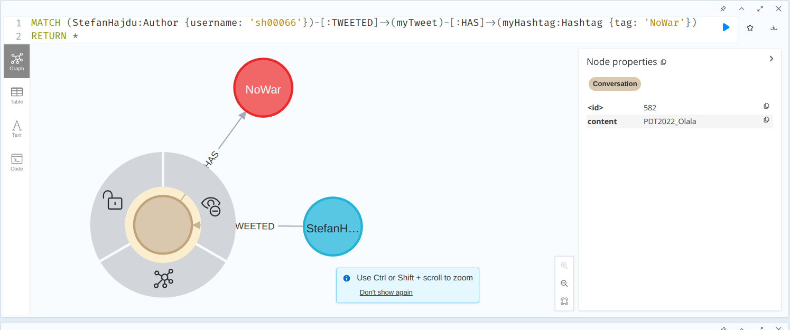
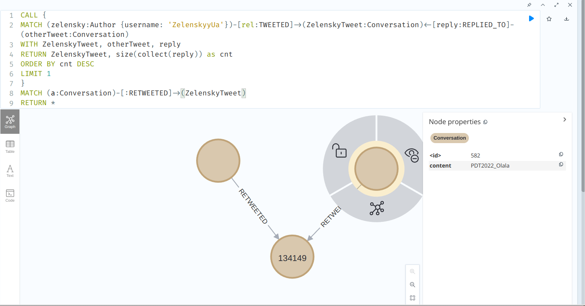
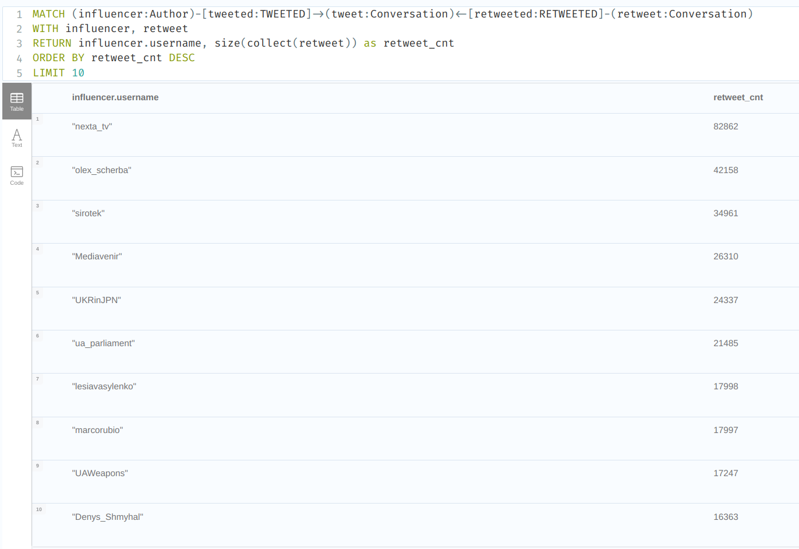
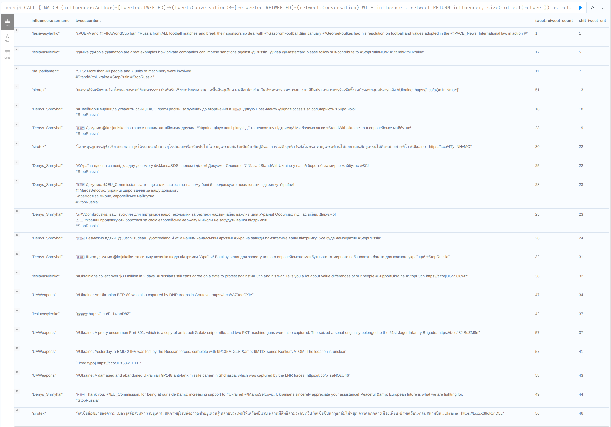
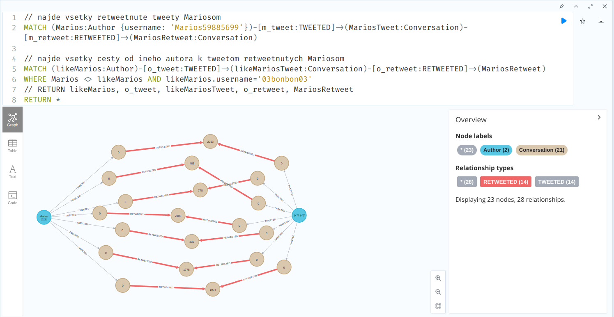
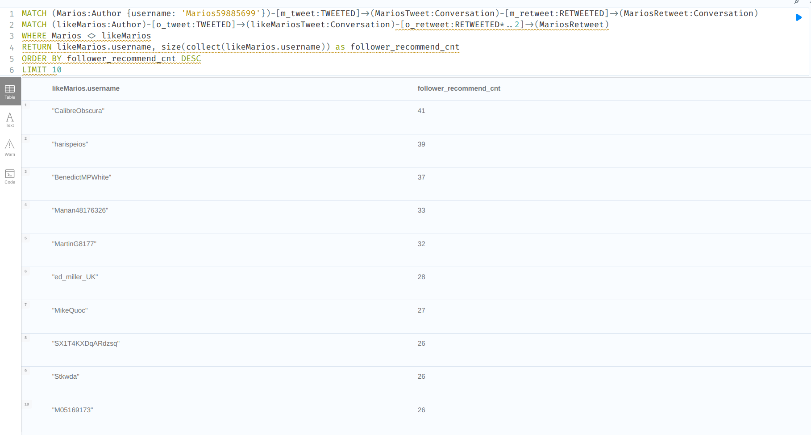
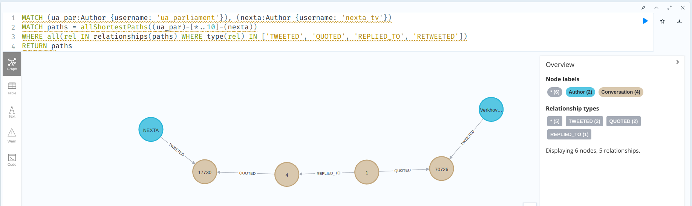
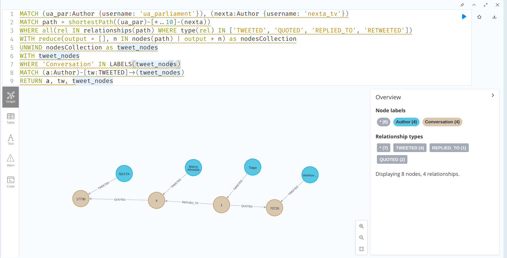
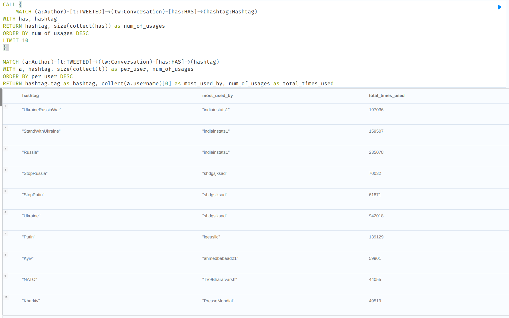

# Zadanie IV.

| **Vypracoval**: | Štefan Hajdú                                                   |
| --------------- | -------------------------------------------------------------- |
| **GitHub**:     | https://github.com/StefanHajdu/PDT-22/tree/master/Assignment_4 |

## Úloha 1

**Vytvorte volaním iba jednej query nového Autora s Vašim menom (vyplňte
minimálne name a username) a tým istým volaním vytvorte tweet ktorý bude
obsahovať aspoň jeden vami vybraný Hashtag (vzťah :HAS) a ktorý bude retweetovať
najretweetovanejší tweet Vladimíra Zelenského{username:"ZelenskyyUa"}.**

V subquery najprv nájdeme tweet, ktorý spĺňa:

- jeho autorom je `username: ZelenskyyUa`
- najviackrát sa naň odkazovali iné tweety cez vzťah `REPLIED_TO`

Potom, už len pomocou `CREATE` vytvoríme:

1. uzol typu Author
2. uzol typu Conversation
3. vzťahy medzi vytvorenými uzlami, ľubovoľným hashtagom a Zelenskyho tweetom

**Výsledné Query:**

```SQL
CALL {
    MATCH (zelensky:Author {username: 'ZelenskyyUa'})-[rel:TWEETED]->(ZelenskyTweet:Conversation)<-[reply:REPLIED_TO]-(otherTweet:Conversation)
    WITH ZelenskyTweet, otherTweet, reply
    RETURN ZelenskyTweet, size(collect(reply)) as cnt
    ORDER BY cnt DESC
    LIMIT 1
}
CREATE (StefanHajdu:Author {name: 'StefanHajdu', username:'sh00066'})
CREATE (myTweet:Conversation {content: 'PDT2022_Olala'})
CREATE (StefanHajdu)-[:TWEETED]->(myTweet)-[:HAS]->(myHashtag:Hashtag {tag: 'NoWar'})
CREATE (myTweet)-[:RETWEETED]->(ZelenskyTweet)
```

**Kontrola**:

Toto query kontoroluje, či sme naozaj vytvorili nášho autora spolu s tweetom a hashtagom.

```SQL
MATCH (StefanHajdu:Author {username: 'sh00066'})-[:TWEETED]->(myTweet)-[:HAS]->(myHashtag:Hashtag {tag: 'NoWar'})
RETURN *
```



Toto query kontroluje, či sme vytvorili retweet na Zelenskyho tweet. Vidíme, že nami pridaný tweet sa ukázal medzi všetkými tweetami, ktoré retweetujú Zelenskyho tweet.

```SQL
CALL {
    MATCH (zelensky:Author {username: 'ZelenskyyUa'})-[rel:TWEETED]->(ZelenskyTweet:Conversation)<-[reply:REPLIED_TO]-(otherTweet:Conversation)
    WITH ZelenskyTweet, otherTweet, reply
    RETURN ZelenskyTweet, size(collect(reply)) as cnt
    ORDER BY cnt DESC
    LIMIT 1
}
MATCH (a:Conversation)-[rel:REPLIED_TO]->(ZelenskyTweet)
RETURN a, rel, ZelenskyTweet
```



## Úloha 2

**Vyhľadajte zlyhania influencerov. Vyhľadajte 20 najmenej retweetovanych tweetov
od Accountov, ktoré sú na prvých 10 miestach v celkovom počte retweetov. Aj keď
taký príklad v datasete nie je, počítajte aj s prípadom, ak by niektorý tweet bol
retweetnutý 0 krát.**

Najprv si nájdeme top 10 "influencerov". Sú to takí autori, ktorých tweety, boli najviackrát spojené s iným tweetom cez vzťah `RETWEETED`.

**Query pre 10 najvačších influencerov podľa počtu retweetov:**

```SQL
MATCH (influencer:Author)-[tweeted:TWEETED]->(tweet:Conversation)<-[retweeted:RETWEETED]-(retweet:Conversation)
WITH influencer, retweet
RETURN influencer, size(collect(retweet)) as retweet_cnt
ORDER BY retweet_cnt DESC
LIMIT 10
```



Ak už poznáme top influenecerov potom ich zaváhania sú tie ich tweety, ktoré majú najmenej spojení cez vzťah `RETWEETED`. Teda pre každý tweet od influencera spočítame počet vzťahov `RETWEETED` a zoradíme ich vzostupne.

**Výsledné Query:**

```SQL
CALL {
    MATCH (influencer:Author)-[tweeted:TWEETED]->(tweet:Conversation)<-[retweeted:RETWEETED]-(retweet:Conversation)
    WITH influencer, retweet
    RETURN influencer, size(collect(retweet)) as retweet_cnt
    ORDER BY retweet_cnt DESC
    LIMIT 10
}

MATCH (influencer)-[:TWEETED]->(tweet:Conversation)
MATCH (tweet)<-[retweeted:RETWEETED]-(otherTweet:Conversation)
RETURN influencer.username, tweet.content, tweet.retweet_count, size(collect(retweeted)) as bad_tweet_cnt
ORDER BY bad_tweet_cnt
LIMIT 20
```

**Výsledok:**



Vo výsledky vidíme, že všetci uvedení influenceri, sú naozaj z top 10.

## Úloha 3

**Odporučte používateľovi (username: Marios59885699) followovanie ďalších autorov
na základe zhody v retweetovaní rovnakých tweetov: Vyhľadajte 10 autorov, ktorí
retweetli najviac tweetov rovnakych, ako používateľ Marios59885699. Počítajú sa aj
retweety tweetov, ktoré retweetujú rovnaký tweet.**

Pre lepšie pochopenie sme si najprv vizualizovali ako daná situácia (zhoda retweetov) vyzerá.

**Vizualizácia retweet-ovania rovnaných tweetov medzi dvoma autormi:**

```SQL
MATCH (Marios:Author {username: 'Marios59885699'})-[m_tweet:TWEETED]->(MariosTweet:Conversation)-[m_retweet:RETWEETED]->(MariosRetweet:Conversation)

MATCH (likeMarios:Author)-[o_tweet:TWEETED]->(likeMariosTweet:Conversation)-[o_retweet:RETWEETED*..2]->(MariosRetweet)
WHERE Marios <> likeMarios AND likeMarios.username = '03bonbon03'
RETURN likeMarios
```



Vo výslednom query najprv nájedeme všetky tweety, ktoré retweetoval Marios. Potom k týmto tweetom nájdeme všetkých autorov, ktorí nie sú Marios, ale retweetovali rovnaké tweety. Pri vzťahu sme nastavili hĺbku pre vzťah `RETWEETED` na interval 1 alebo 2, teda uvažujeme aj o retweetoch, ktoré retweetujú rovnaký (Mariosov) tweet. Najdených autorov potom už len spočítame a zoradíme.

**Výsledné Query:**

```SQL
MATCH (Marios:Author {username: 'Marios59885699'})-[m_tweet:TWEETED]->(MariosTweet:Conversation)-[m_retweet:RETWEETED]->(MariosRetweet:Conversation)
MATCH (likeMarios:Author)-[o_tweet:TWEETED]->(likeMariosTweet:Conversation)-[o_retweet:RETWEETED*..2]->(MariosRetweet)
WHERE Marios <> likeMarios
RETURN likeMarios.username, size(collect(likeMarios.username)) as follower_recommend_cnt
ORDER BY follower_recommend_cnt DESC
LIMIT 10
```



## Úloha 4

**Nájdite najkratšie cesty medzi Ukrajinským parlamentom (username:
“ua_parliament”) a NextaTV (username: “nexta_tv”) cez vzťahy TWEETED,
RETWEETED, REPLIED_TO a QUOTED. Hľadajte do hĺbky maximálne 10. (hint:
allShortestPaths)**

Riešením je použiť funciu `allShortestPaths`, medzi uzlami “ua_parliament” a “nexta_tv”. V parametri funkcie sme definovali filter na hľadanie iba vzťahov, ktoré sú povolené v zadaní, rovnako aj interval pre hĺbku hľadania. Funckia nám vráti iba jedinú cestu, ktorá sa rovná najkratšej ceste medzi danými uzlami.

**Výsledné Query:**

```SQL
MATCH (ua_par:Author {username: 'ua_parliament'}), (nexta:Author {username: 'nexta_tv'})
MATCH paths = allShortestPaths((ua_par)-[r1:TWEETED|RETWEETED|REPLIED_TO|QUOTED*..10]-(nexta))
RETURN paths
```



## Úloha 5

**Upravte query z predchádzajúcej úlohy, aby vrátila iba nájdenú najkratšiu cestu a
jednotlivé uzly typu Conversation v nej aj spolu z autorom, ktorý ich tweetol. (hint:
UNWIND)**

Najprv nájdeme najkratšiu cestu. Túto cestu je potrebné rozdeliť na jednotlivé uzly (pomocou UNWIND), aby sme mohli odfiltrovať uzly typu `Author`. Tým nám zostane iba množina konverzácií, ku ktorým jednoducho nájedeme autorov cez vzťah `TWEETED`.

**Výsledné Query:**

```SQL
MATCH (ua_par:Author {username: 'ua_parliament'}), (nexta:Author {username: 'nexta_tv'})
MATCH path = shortestPath((ua_par)-[r1:TWEETED|RETWEETED|REPLIED_TO|QUOTED*..10]-(nexta))
WITH nodes(path) as nodesCollection
UNWIND nodesCollection as tweet_nodes
WITH tweet_nodes
WHERE 'Conversation' IN LABELS(tweet_nodes)
MATCH (a:Author)-[tw:TWEETED]->(tweet_nodes)
RETURN a, tw, tweet_nodes
```



## Úloha 6

**Vypíšte 10 najpoužívanejších hashtagov v datasete aj s celkovým počtom použití a
autorom, ktorý daný hashtag najviac krát použil. (hint: collect)**

V subquery si najprv nájdeme 10 najpoužívanejších hashtagov (najpoužívanejší je ten, ktorý má najviac vzťahov `HAS`). Subquery nám vráti hashtagy aj s celkovým počtom použitia.

Potom na tieto hashtagy namapujeme na autorov, ktorý ich použili. Pre každého autora a hashtag spočítame počet vzťahov `TWEETED`, to nám dá informáciu o tom, koľkokrát bol daný hashtag použitý daným autorom, následne výsledok podľa tohto počtu zoradíme. Tým dostaneme top autorov, pre každý hashtag.
Následne autorov spojíme do zoznamu (pomocou `collect()`). Tým že sme výsledok zoradili, tak vieme, že prvý autor v zozname je najčastejší používateľ, preto zo zoznamu vyberieme iba prvého (index [0])

**Výsledné Query:**

```SQL
CALL {
    MATCH (a:Author)-[t:TWEETED]->(tw:Conversation)-[has:HAS]->(hashtag:Hashtag)
    WITH has, hashtag
    RETURN hashtag, size(collect(has)) as num_of_usages
    ORDER BY num_of_usages DESC
    LIMIT 10
}

MATCH (a:Author)-[t:TWEETED]->(tw:Conversation)-[has:HAS]->(hashtag)
WITH a, hashtag, size(collect(t)) as per_user, num_of_usages
ORDER BY per_user DESC
RETURN hashtag.tag as hashtag, collect(a.username)[0] as most_used_by, num_of_usages as total_times_used
```


