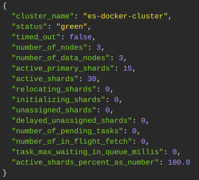
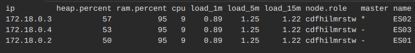
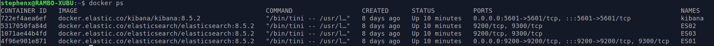
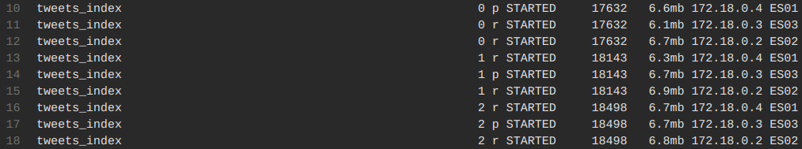
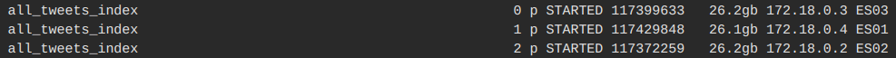
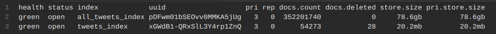

# Zadanie V.

| Vypracoval: | Štefan Hajdú                                                   |
| ----------- | -------------------------------------------------------------- |
| GitHub:     | https://github.com/StefanHajdu/PDT-22/tree/master/Assignment_5 |

## Úloha 1:

### **Rozbehajte si 3 inštancie Elasticsearch-u**

Troj-nódový cluster sme rozbehali pomocou dockera. Klaster je definovaný v `elastic-cluster/docker-compose`, pričom sme vychádzali [z oficiálneho návodu](https://www.elastic.co/guide/en/elasticsearch/reference/current/docker.html).

Z konfigurácie sme vynachali nastavenia `xpack.security` a `xpack.licence`.

Po spustení:

```console
docker-compose up
```

Vidíme, že skutočne nám bežia 3 inštancie Elastic nodov:




Kibanu sme nepoužili aj keď je spustená.

## Úlohy 2, 3 a 4:

Tieto úlohy sme spojili do jedného requestu pre vytvorenie indexu.

### **Vytvorte index pre Tweety, ktorý bude mať “optimálny“ počet shardov a replík pre 3 nódy (aby tam bola distribúcia dotazov vo vyhľadávaní, aj distribúcia uložených dát)**

Počet shardov sme pre index definovali:

```json
"index": {
      "number_of_shards": 3,
      "number_of_replicas": 2,
      "max_ngram_diff": 9
    }
```

Čo by nám malo nastaviť klaster v nasledujúcej konfigurácii:

| Node | Primary shard (PS) | Replicas (R) |
| ---- | ------------------ | ------------ |
| ES01 | PS_01              | R_02, R_03   |
| ES02 | PS_02              | R_01, R_03   |
| ES03 | PS_03              | R_01, R_02   |

Na každom node máme pripravené všetky 3 shardy, teda klaster by mal byť schopný servovať dáta aj pri výpadku 2 nodov. 3 shardy sme schopný prehľadávať paralelne. K dispozícií sme mali procesor so 4 CPU, teda každý node vie mať vlastné CPU. Paralelné vyhľadávanie je možné aj pri výpadku 1 nodu, pretože ten bude zastúpený replikou na inom node, ktorý je na vlastnom CPU.

Pre 3 primárne shardy sme sa rozhodli podľa literatúry [Elasticsearch in Action, Second Edition](https://www.manning.com/books/elasticsearch-in-action-second-edition), kde sa uvádza pre voľbu počtu shardov nasledovné:

"_...There is no one-size-
fits-all here. According to the organization’s current data requirements and future needs, one must
carry out (with due diligence) sizing trials to get a conclusive result. The industry’s best practice is
to size an individual shard with no more than 50 GB... My personal
advice is to keep them between 25 GB and 40 GB keeping the node’s heap memory in mind..._"

V našom prípade sme očakávali približne 80GB dát, čo vieme podľa tohto odporúčania najlepšie rozdeliť na 3 shardy, kde každý bude na separátnom node.

### **Vytvorte mapping pre normalizované dáta z Postgresu (denormalizujte ich) – Každý Tweet teda musí obsahovať údaje rovnaké ako máte už uložené v PostgreSQL (všetky tabuľky). Dbajte na to, by ste vytvorili polia v správnom dátovom type (polia ktoré má zmysel analyzovať analyzujte správne, tie ktoré nemá, aby neboli zbytočne analyzované (keyword analyzer)) tak aby index nebol zbytočne veľký, pozor na nested – treba ho použiť správne. Mapovanie musí byť striktné. Čo sa týka väzieb cez referencies – pre ne zaindexujte type vsťahu, id, autor (id, name, username), content a hashtags.**

Vytvorený mapping pre denormalizovanú databázu:

Dokument je rozdelený do niekoľkých subsekcii:

- metadata: informácie o tweete

```json
"metadata": {
        "properties": {
        "id": {"type": "long"},
        "author_id": {"type": "long"},
        "content": {
            "type": "text",
            "analyzer": "englando"
        },
        "possibly_sensitive": {"type": "boolean"},
        "language": {"type": "keyword"},
        "source": {"type": "keyword"},
        "retweet_count": {"type": "integer"},
        "reply_count": {"type": "integer"},
        "like_count": {"type": "integer"},
        "quote_count": {"type": "integer"},
        "created_at": {"type": "date"}
    }
}
```

Text tweetu je analyzovaný custom analýzátorom `englando`.

- author: informácie o autorovi tweetu

```json
"author": {
    "properties": {
        "id": {"type": "long"},
        "username": {
            "type": "text",
            "fields": {
                "username_ngram": {
                    "type": "text",
                    "analyzer": "custom_ngram"
                }
            }
        },
        "name": {
            "type": "text",
            "fields": {
                "name_shingle": {
                    "type": "text",
                    "analyzer": "custom_shingles"
                },
                "name_ngram": {
                    "type": "text",
                    "analyzer": "custom_ngram"
                }
            }
        },
        "description": {
            "type": "text",
            "fields": {
                "description_shigles": {
                    "type": "text",
                    "analyzer": "custom_shingles"
                }
            }
        },
        "followers_count": {"type": "integer"},
        "following_count": {"type": "integer"},
        "tweet_count": {"type": "integer"},
        "listed_count": {"type": "integer"},
        "fts_username_eng": {
            "type": "keyword",
            "index": false
        },
        "fts_description_eng": {
            "type": "keyword",
            "index": false
        }
    }
}
```

Keďže v ES je možné priradiť iba jeden analyzátor pre pole, tak aby sme vyhoveli požiadavnkám úlohy 4, tak sme polia `name, username` vytvorili duplikácie, ktoré sú analyzované inak ako štandardným analyzátorom. Teda ak chceme hľadať pomocou analyzátora `custom_shingles`, tak bude analyzovať pole: `author->description->description_shigles`.

Polia `fts_username_eng a fts_description_eng` sú zabudnuté pozostatky, ktoré sa neindexujú.

Pre nasledujúce polia sme využili typ `nested`, keďže každý tweet ich môže mať 0 až N. Štruktúra týchto polí je pomerne self-explanatory:

- links: informácie o odkazoch

  ```json
    "links": {
        "type": "nested",
        "properties": {
            "id": {"type": "long"},
            "conversation_id": {"type": "long"},
            "url": {"type": "keyword"},
            "title": {"type": "keyword"},
            "description": {"type": "keyword"}
        }
    }
  ```

- domains: informácie o doménach

  ```json
    "domains": {
        "type": "nested",
        "properties": {
            "id": {"type": "long"},
            "name": {"type": "text"},
            "desc": {"type": "text"}
        }
    }
  ```

- entitiies: informácie o entitách

  ```json
    "entitiies": {
        "type": "nested",
        "properties": {
            "id": {"type": "long"},
            "name": {"type": "text"},
            "desc": {"type": "text"}
        }
    }
  ```

- hashtags: informácie o hashtagoch

  ```json
      "hashtags": {
          "type": "nested",
          "properties": {
              "id": {"type": "long"},
              "tag": {
                  "type": "text",
                  "analyzer": "just_lowercase"
              }
          }
      }
  ```

  Hashtagy sú indexované ako lowercase.

- annotations: informácie o anotáciach

  ```json
  "annotations": {
      "type": "nested",
      "properties": {
          "id": {"type": "long"},
          "conversation_id": {"type": "long"},
          "value": {"type": "keyword"},
          "type": {"type": "keyword"},
          "probability": {"type": "half_float"}
      }
  }
  ```

  Toto pole by sa dalo vyriešiť aj pomocou obyčajného typu `object`, keďže sa nad ním neplánuje vykonávať vyhľadávanie v úlohe 10.

- referencies: informácie a tweetoch na ktoré sa dokumnet odkazuje

  ```json
  "referencies": {
      "type": "nested",
      "properties": {
          "type": {"type": "keyword"},
          "ref_id": {"type": "long"},
          "ref_content": {
              "type": "text",
              "analyzer": "englando"
          },
          "ref_author_id": {"type": "long"},
          "ref_author_username": {
              "type": "text",
              "fields": {
                  "username_ngram": {
                      "type": "text",
                      "analyzer": "custom_ngram"
                  }
              }
          },
          "ref_author_name": {
              "type": "text",
              "fields": {
                  "name_shingle": {
                      "type": "text",
                      "analyzer": "custom_shingles"
                  },
                  "name_ngram": {
                      "type": "text",
                      "analyzer": "custom_ngram"
                  }
              }
          },
          "ref_hashtags": {
              "type": "nested",
              "properties": {
                  "id": {"type": "long"},
                  "tag": {
                      "type": "text",
                      "analyzer": "just_lowercase"
                  }
              }
          }
      }
  }
  ```

  Polia pre autora referencie sme analyzovali rovnako ako polia v `author`.

Typy pre polia sme priraďovali podľa zadania úlohy 10:

- `text`, nad týmto polom sa **plánuje** full-text search, teda je potrebné ho analyzovať
- `keyword`, nad týmto polom sa **neplánuje** full-text search, teda nie je potrebné ho analyzovať

Pri tvorbe dokumentu sme zvolili metódy duplikovania obsahu, teda každý indexovaný dokument/tweet v sebe obsahuje všetky informácie, ktoré sa ho priamo týkajú. Teda nie je potrebné robiť join s iým dokumentom.

### **Pre index tweets vytvorte 3 vlastné analyzéry (v settings) nasledovne:**

```json
"analysis": {
    "analyzer": {
    "englando": {
        "type": "custom",
        "char_filter": ["html_strip"],
        "tokenizer": "standard",
        "filter": [
        "lowercase",
        "english_stop",
        "english_possessive_stemmer",
        "english_stemmer"
        ]
    },
    "custom_shingles": {
        "type": "custom",
        "char_filter": ["html_strip"],
        "tokenizer": "standard",
        "filter": ["lowercase", "asciifolding", "filter_shingles"]
    },
    "custom_ngram": {
        "type": "custom",
        "char_filter": ["html_strip"],
        "tokenizer": "standard",
        "filter": ["lowercase", "asciifolding", "filter_ngrams"]
    },
            "just_lowercase": {
                "type": "custom",
                "tokenizer": "standard",
                "filter": ["lowercase"]
            }
    },
    "filter": {
        "english_stop": {
            "type": "stop",
            "stopwords": "_english_"
        },
        "english_possessive_stemmer": {
            "type": "stemmer",
            "stem_english_possessives": true
        },
        "english_stemmer": {
            "type": "stemmer",
            "language": "english"
        },
        "filter_shingles": {
            "type": "shingle",
            "min_shingle_size": 2,
            "max_shingle_size": 3,
            "token_separator": " "
        },
        "filter_ngrams": {
            "type": "ngram",
            "min_gram": 1,
            "max_gram": 10
        }
    }
}
```

Celý dopyt pre vytvorenie indexu je uvedený v `requests/create-index.json`.

## Úlohy 5, 6 a 9:

### **Vytvorte bulk import pre vaše normalizované Tweety.**

Tieto úlohy sme riešili ako jednu úlohu.

Tu bolo naším cieľom denormalizovať databázu podľa vytvoreného mappingu. Teda sme chceli vytvoriť extra tabuľku, kde každý riadok bude jeden dokument už pripravený ako JSON objekt.

Výhody denormalizácie:

- nebude treba vykonávať joiny počas behu importu
- pomocou agregačných funkcií [json_object_agg](https://www.sqliz.com/postgresql-ref/json_object_agg/) a [json_agg](https://www.sqliz.com/postgresql-ref/json_agg/) si vieme vytvoriť json objekty priamo v databáze, teda nebude potrebné extra spracovanie v import skripte
- parsovanie vyriešime už priamo v databáze

**Riešenie:**

1. Pre urýchlenie JOIN sme vytvorili indexy nad všetkými FK:

   ```sql
   create index idx_an_conv_id on annotations using btree(conversation_id);
   create index idx_ca_conv_id on context_annotations using btree(conversation_id);
   create index idx_ca_domain_id on context_annotations using btree(context_domain_id);
   create index idx_ca_entity_id on context_annotations using btree(context_entity_id);
   create index idx_hs_conv_id on z_tweets_denormalized using btree(iconversation_idd);
   create index idx_hs_hashtag_id on conversation_hashtags using btree(hashtag_id);
   create index idx_ln_conv_id on links using btree(conversation_id);
   ```

2. denormalizácia tabuliek:

   - conversations
   - links
   - annotations
   - context_domains
   - context_entities
   - hashtags

   Použili sme LEFT JOIN do tabuľky `convesations`, aby sme zachovali počet tweetov.

   ```sql
   create table z_tweets_denormalized as
       select
           conversations.id,
           json_build_object(
               'metadata', conversations,
               'author', authors,
               'annotations', annotations,
               'links', links,
               'domains', domains,
               'entities', entities,
               'hashtags', hashtags
           ) as tweet
       from
           conversations
       inner join
           authors
       on
           conversations.author_id = authors.id
       left join
           (
               select
                   conversations.id as conv_annot_id, json_agg(annotations) as annotations
               from
                   conversations
               left join
                   annotations
               on
                   conversations.id = annotations.conversation_id
               group by
                   conversations.id
           ) as conv_annot
       on
           conversations.id = conv_annot_id
       left join
           (
               select
                   conversations.id as conv_links_id, json_agg(links) as links
               from
                   conversations
               left join
                   links
               on
                   conversations.id = links.conversation_id
               group by
                   conversations.id
           ) as conv_links
       on
           conversations.id = conv_links_id
       left join
           (
               select
                   conversations.id as conv_domain_id, json_agg(context_domains) as domains
               from
                   conversations
               left join
                   context_annotations
               on
                   conversations.id = context_annotations.conversation_id
               left join
                   context_domains
               on
                   context_annotations.context_domain_id = context_domains.id
               group by
                   conversations.id
           ) as conv_domain
       on
           conversations.id = conv_domain_id
       left join
           (
               select
                   conversations.id as conv_entity_id, json_agg(context_entities) as entities
               from
                   conversations
               left join
                   context_annotations
               on
                   conversations.id = context_annotations.conversation_id
               left join
                   context_entities
               on
                   context_annotations.context_domain_id = context_entities.id
               group by
                   conversations.id
           ) as conv_entities
       on
           conversations.id = conv_entity_id
       left join
           (
               select
                   conversations.id as conv_tag_id, json_agg(hashtags) as hashtags
               from
                   conversations
               left join
                   conversation_hashtags
               on
                   conversations.id = conversation_hashtags.conversation_id
               left join
                   hashtags
               on
                   conversation_hashtags.hashtag_id = hashtags.id
               group by
                   conversations.id
           ) as conv_hash
       on
           conversations.id = conv_tag_id


   create index idx_tweet_id on z_tweets_denormalized using btree(id);
   ```

   Tabuľka nemala index nad polom ID, preto sme ho vytvorili, aby sme mohli rýchlejšie joinovať referencie.

   Query sa vykonalo za približne 30 min.

3. Spojenie tweetov s ich referenciami, a tým vytvorenie kompletného dokumentu. Keďže sme pre každý referencovaný tweet potrebovali aj autora aj hashtagy, bolo potrebné vykonať join všetkých existujúcich referencii s autormi a hashtagmi. Až následne sa to mohlo joinnúť s dokumentom.

   ```sql
   create table z_tweet_json as
       select
           z_tweets_denormalized.id,
           json_build_object(
               'metadata', z_tweets_denormalized.tweet->'metadata',
               'author', z_tweets_denormalized.tweet->'author',
               'annotations', z_tweets_denormalized.tweet->'annotations',
               'links', z_tweets_denormalized.tweet->'links',
               'domains', z_tweets_denormalized.tweet->'domains',
               'entities', z_tweets_denormalized.tweet->'entities',
               'hashtags', z_tweets_denormalized.tweet->'hashtags',
               'referencies', referencies
           ) as tweet
       from
           z_tweets_denormalized
       left join
           (
               select
                   z_tweets_denormalized.id as ref_id,
                   json_agg(
                       json_build_object(
                           'type', conversation_references.type,
                           'ref_id', referenced_conv.tweet->'metadata'->'id',
                           'ref_content', referenced_conv.tweet->'metadata'->'content',
                           'ref_author_id', referenced_conv.tweet->'author'->'id',
                           'ref_author_name', referenced_conv.tweet->'author'->'name',
                           'ref_author_username', referenced_conv.tweet->'author'->'username',
                           'ref_hashtags', referenced_conv.tweet->'hashtags'
                       )
                   ) as referencies
               from
                   z_tweets_denormalized
               left join
                   conversation_references
               on
                   conversation_references.conversation_id = z_tweets_denormalized.id
               left join
                   z_tweets_denormalized as referenced_conv
               on
                   conversation_references.parent_id = referenced_conv.id
               group by
                   z_tweets_denormalized.id
           ) as tweets_refs
       on
           z_tweets_denormalized.id = ref_id
   ```

   Query sa vykonalo za približne 1 hodinu 40 minút. Tabuľku z_tweets_denormalized bolo možné po tomto joine vymazať.

Nakoniec ešte uvedieme príklad jedného riadka zo stĺpca `tweet`, ktorý obsahuje celý dokument (nie je možné ho screen-shotnúť kvôli dĺžke):

```json
{
    "metadata": {
        "id": 851268950419587074,
        "author_id": 1651522832,
        "content": "@KremlinTrolls @LouiseMensch @EUvsDisinfo @JessikkaAro @IlvesToomas @McFaul @Billbrowder @lizwahl @alanagoodman @MollyMcKew @NATOpress @ChristopherJM #Putin murders Voronenkov, *coincidentally* slated to testify against Yanukovych, would've incriminated Manafort.\\n\\nhttps://t.co/bRZqA8BsWs",
        "possibly_sensitive": false,
        "language": "en",
        "source": "Twitter for iPad",
        "retweet_count": 42,
        "reply_count": 2,
        "like_count": 49,
        "quote_count": 2,
        "created_at": "2017-04-10T05:01:48+02:00"
      },
    "author": {
        "id": 1651522832,
        "name": "Dena Grayson, MD, PhD",
        "username": "DrDenaGrayson",
        "description": "Ran for Congress. Lover of #science, truth and democracy. Appearances: @FoxNews, @SkyNews, @BBC @60Mins; featured: @NYTimes, @BostonGlobe.",
        "followers_count": 316562,
        "following_count": 478,
        "tweet_count": 80504,
        "listed_count": 2506,
        "fts_username_eng": "'drdenagrayson':1",
        "fts_description_eng": "'60mins':14 'appear':10 'bbc':13 'bostonglob':17 'congress':3 'democraci':9 'featur':15 'foxnew':11 'lover':4 'nytim':16 'ran':1 'scienc':6 'skynew':12 'truth':7"
      },
      "annotations": [
        {
          "id": 18874744,
          "conversation_id": 851268950419587074,
          "value": "Voronenkov",
          "type": "Person",
          "probability": 0.451
        },
        {
          "id": 18874745,
          "conversation_id": 851268950419587074,
          "value": "Yanukovych",
          "type": "Organization",
          "probability": 0.434
        },
        {
          "id": 18874746,
          "conversation_id": 851268950419587074,
          "value": "Manafort",
          "type": "Person",
          "probability": 0.926
        }
      ],
      "links": [
        {
          "id": 11026803,
          "conversation_id": 851268950419587074,
          "url": "https://twitter.com/kremlintrolls/status/845027796787351555",
          "title": null,
          "description": null
        }
      ],
      "domains": [null],
      "entities": [null],
      "hashtags": [{ "id": 1, "tag": "Putin" }],
      "referencies": [
        {
          "type": "quoted",
          "ref_id": 845027796787351555,
          "ref_content": "Within 20 mins of Putin critic Voronenkov shot dead in cold blood, @GicAriana was smearing him, making provocations (w/ Kremlin help)\\n\\nSick https://t.co/u7qT1LRnc8",
          "ref_author_id": 4361001253,
          "ref_author_name": "KT \"Special NATO Intelligence Operation\"",
          "ref_author_username": "KremlinTrolls",
          "ref_hashtags": [null]
        },
        {
          "type": "replied_to",
          "ref_id": 845027796787351555,
          "ref_content": "Within 20 mins of Putin critic Voronenkov shot dead in cold blood, @GicAriana was smearing him, making provocations (w/ Kremlin help)\\n\\nSick https://t.co/u7qT1LRnc8",
          "ref_author_id": 4361001253,
          "ref_author_name": "KT \"Special NATO Intelligence Operation\"",
          "ref_author_username": "KremlinTrolls",
          "ref_hashtags": [null]
        }
      ]
    }
  ]
}
```

### **Importujete dáta do Elasticsearchu prvych 5000 tweetov**

Skript `bulk-import/bulk_import_5000.py` je pomerne jednoduchý:

1. Pomocou SQL:

```sql
select tweet from z_tweet_json
limit 5000;
```

načítame prvých 5000 dokumentov z databázy.

2. Pri denormalizácií v Postregese sme neuviedli v dokumente pole `_index` (pre určenie mena indexu v ES), preto sme museli vrátené záznamy prejsť a toto pole tam doplniť:

```python
def get_docs(cursor):
    docs = []
    for r in cursor.fetchall():
        r[0]["_index"] = INDEX_NAME
        docs.append(r[0])
    deque(parallel_bulk(es, docs, thread_count=8, chunk_size=500))
```

3. Nakoniec pomocou paralelizovanej verzie bulk importu sme mohli vložiť list dokumentov do ES. Parametre pe `parallel_bulk` sme určili experimentovaním. V použitej konfigurácií na nám podarilo znížiť import čas na 2.5 sekundy oproti 5 sekundám, ktoré potreboval `bulk`.

Shardy po inserte:


### **Zrušte repliky a importujete všetky tweety**

My sme repliky v pôvodnom indexe `tweet_index` nerušili. Ale pre prehľadnosť sme si vytvorlili nový index `all_tweets_index`, kde sme ponechali rovnký request, kde sme zmenili iba `"number_of_replicas": 0`. Ale repliky by sme vedeli dropnúť v pôvodnot indexe updatom nad `_settings`:

```json
// http://localhost:9200/tweets_index/_settings
{
  "index": {
    "number_of_replicas": 0
  }
}
```

Skript `bulk-import/bulk_import_db_iterator.py` sa zhoduje s predchádzajúcim skriptom `bulk-import/bulk_import_5000.py` v krokoch 2. a 3.

Problém nám robilo iterovanie cez tabuľku dokumentov. Tu sme skúsili tieto možnosti:

1. Postgres adaptér [psycopg2](https://stackoverflow.com/questions/41444890/how-to-use-server-side-cursors-with-psycopg2) a nastavenie cursora do iteratívneho módu pomocou parametra `itersize`: toto hoci vyzeralo, nádejne neboli sme načítané riadky po jednom upraviť a vložiť do pola, ktoré by sa ďalej odoslalo do ES.

2. Využitie raw SQL prístupu pomocou LIMIT a OFFSET:

```sql
select tweet from z_tweet_json
limit %s offset %s
```

kde sme OFFSET postupne posúvali o 100 000 záznamov ďalej. Tento import bol na začiatku úspešný, ale čas importu sa predlžoval s rastúcou hodnotou OFFSETU. Začali sme na 30s per 100 000, ale pri OFFSETE 13 000 000 bol čas 80s per 100 000. Preto toto riešenie odporúčame pre malé datasety.

3. Najlepším riešením sa ukázalo byť použitie [pandas.read_sql](https://www.architecture-performance.fr/ap_blog/reading-a-sql-table-by-chunks-with-pandas/) funkcie, s ktorou sme vedeli čítať tabuľku po 100 000 chunkoch bez časovej penalizácie.

Finálny skript je pomerne jednoduchý, keďže na aplikačnej vrstve nie je potrebná ďalšia úprava dát, pretože celý dokument máme už predpripravený v databáze.

Pri importe sme nastavili `request_timeout` na 300 sekúnd, pretože v prípade pužitia OFFSET a LIMIT prítupu import padol na timeout chybe. Pri pandase, hoci bol nastavený nebol potrebný.

Výtup je uvedený v `bulk-import/bulk_import_log`, kde vidíme, že celý import trval približne 3 hodiny, pričom 100 000 dokumentov bolo vytvorených za približne 35 sekúnd.

Shardy po inserte:


Nakoniec máme takéto indexy:


## Úloha 7

### **Experimentujte s nódami, a zistite koľko nódov musí bežať (a ktoré) aby vám Elasticsearch vedel pridávať dokumenty, mazať dokumenty, prezerať dokumenty a vyhľadávať nad nimi?**

Nody sme vypínali pomocou príkazu:

```console
docker stop [node_name]
```

Na začiatku máme túto konfiguráciu:

```console
ip         heap.percent ram.percent cpu load_1m load_5m load_15m node.role   master name
172.18.0.4           42          98   8    2.83    1.50     1.14 cdfhilmrstw *      ES02
172.18.0.3           29          98   9    2.83    1.50     1.14 cdfhilmrstw -      ES01
172.18.0.2           56          98  12    2.83    1.50     1.14 cdfhilmrstw -      ES03

tweets_index    0 r STARTED         0   1.3mb 172.18.0.3 ES01
tweets_index    0 p STARTED         0   1.2mb 172.18.0.2 ES03
tweets_index    0 r STARTED         0   1.2mb 172.18.0.4 ES02
tweets_index    1 p STARTED         0   1.3mb 172.18.0.3 ES01
tweets_index    1 r STARTED         0   1.3mb 172.18.0.2 ES03
tweets_index    1 r STARTED         0   1.3mb 172.18.0.4 ES02
tweets_index    2 r STARTED         0   1.3mb 172.18.0.3 ES01
tweets_index    2 r STARTED         0   1.2mb 172.18.0.2 ES03
tweets_index    2 p STARTED         0   1.2mb 172.18.0.4 ES02

```

Ako vidíme, tak na každom node máme iný shard.

Zistenie:

1. Ak vypneme node ES01, tak sa nedá dopytovať na klaster, odpovedá chybou:

```console
Error: Couldn't connect to server
```

Ale po opätovnom spustení sa nám prehodia primary shards, teraz je na ES03 P0 aj P1:

```console
tweets_index    0 r STARTED        17688   6.5mb 172.18.0.3 ES01
tweets_index    0 p STARTED        17688   1.2mb 172.18.0.2 ES03
tweets_index    0 r STARTED            0   1.2mb 172.18.0.4 ES02
tweets_index    1 r STARTED        18882   6.8mb 172.18.0.3 ES01
tweets_index    1 p STARTED        18882   6.8mb 172.18.0.2 ES03
tweets_index    1 r STARTED            0   1.3mb 172.18.0.4 ES02
tweets_index    2 r STARTED        17847   6.2mb 172.18.0.3 ES01
tweets_index    2 r STARTED            0   1.2mb 172.18.0.2 ES03
tweets_index    2 p STARTED        17847   1.2mb 172.18.0.4 ES02
```

Čo je zaujímavé, pretože ostané nody sú aktívne.

2. Kombinácia nodov: `ES01 - UP, ES02 - DOWN, ES03 - UP`, umožňuje fungovanie, pre všetky typy operácii.

```console
tweets_index    0 r STARTED        17688   6.5mb 172.18.0.3 ES01
tweets_index    0 p STARTED        17688   6.6mb 172.18.0.2 ES03
tweets_index    0 r UNASSIGNED
tweets_index    1 r STARTED        18882   6.8mb 172.18.0.3 ES01
tweets_index    1 p STARTED        18882   6.8mb 172.18.0.2 ES03
tweets_index    1 r UNASSIGNED
tweets_index    2 p STARTED        17847   6.2mb 172.18.0.3 ES01
tweets_index    2 r STARTED        17847   6.7mb 172.18.0.2 ES03
tweets_index    2 r UNASSIGNED
```

Ako vidíme na ES03 máme dve primary shards (pre shards 0 aj shard 1). A repliky, ktoré boli držané na ES02 sú UNASSIGNED.

Ak listneme všetky záznamy, vidíme, že počet hitov je 5000, teda na dvoch nodoch máme všetky dáta:

```json
// http://localhost:9200/tweets_index/\_search/?size=1000&pretty
"hits": {
		"total": {
			"value": 5000,
			"relation": "eq"
		},
    ...
}
```

Na dvoch nódoch vieme vytvoriť nový dokument s id 5001:

```json
// http://localhost:9200/tweets_index/\_doc/5001
{
  "_index": "tweets_index",
  "_id": "5001",
  "_version": 1,
  "result": "created",
  "_shards": {
    "total": 3,
    "successful": 2,
    "failed": 0
  },
  "_seq_no": 1697,
  "_primary_term": 11
}
```

3. Kombinácia nodov: `ES01 - UP, ES02 - UP, ES03 - DOWN`, umožňuje fungovanie, pre všetky typy operácii.

```console
tweets_index    0 p STARTED        17688   6.5mb 172.18.0.3 ES01
tweets_index    0 r STARTED        17688   6.7mb 172.18.0.4 ES02
tweets_index    0 r UNASSIGNED
tweets_index    1 p STARTED        18889   6.8mb 172.18.0.3 ES01
tweets_index    1 r STARTED        18889   6.9mb 172.18.0.4 ES02
tweets_index    1 r UNASSIGNED
tweets_index    2 p STARTED        17847   6.2mb 172.18.0.3 ES01
tweets_index    2 r STARTED        17847   6.5mb 172.18.0.4 ES02
tweets_index    2 r UNASSIGNED
```

Ako vidíme na ES01 máme všetky primary shards (1, 2, 3). A repliky, ktoré boli držané na ES03 sú UNASSIGNED.

Ak listneme všetky záznamy, vidíme, že počet hitov je 5001, teda na dvoch nodoch máme všetky dáta:

```json
// http://localhost:9200/tweets_index/\_search/?size=1000&pretty
"hits": {
		"total": {
			"value": 5001,
			"relation": "eq"
		},
    ...
}
```

Na dvoch nódoch vieme vytvoriť nový dokument s id 5002:

```json
// http://localhost:9200/tweets_index/\_doc/5002
{
  "_index": "tweets_index",
  "_id": "5002",
  "_version": 1,
  "result": "created",
  "_shards": {
    "total": 3,
    "successful": 2,
    "failed": 0
  },
  "_seq_no": 1697,
  "_primary_term": 11
}
```

4. Samostatne nám ani jeden node nefunguje. Na čo nemám vysvetlenie, keďže sme ukázali, že repliky exitujú a dokážu sa distribuovať ak je to potrebné.

Dostaneme nasledovnú chybu:

```json
{
  "error": {
    "root_cause": [
      {
        "type": "master_not_discovered_exception",
        "reason": null
      }
    ],
    "type": "master_not_discovered_exception",
    "reason": null
  },
  "status": 503
}
```

## Úloha 8

RIP

## Úloha 10:

### **Vyhľadajte vo vašich tweetoch, kde použite function_score pre jednotlivé medzikroky nasledovne:**

Najprv ukážeme časti, a potom celé `function_score` query.

a. Must:

i. Vyhľadajte vo viacerých poliach naraz (konkrétne:
author.description.shingles (pomocou shingle) – boost 10, content
(cez analyzovaný anglický text) spojenie – boost 6 "put1n chr1stian
fake jew", zapojte podporu pre preklepy, operátor je OR.

ii. V poly referencies.content slovo “nazi”

iii. Hashtag “ukraine”

Použili sme must teda toto nám vráti iba dokumenty, ktoré:

- majú aspoň jeden hashtag "ukraine"
- obsahujú nejaké zo slov put1n, chr1stian, fake, jew. Použitý je operátor OR. Fuzziness (toleranciu chyby) sme nastavili na AUTO, ktorá prispôsobí parameter dĺžke termu
- majú aspoň jedna referencia obsahuje slovo "nazi"

```json
"must": [
    {
        // iii.
        "nested": {
            "path": "hashtags",
            "query": {
                "match": {
                    "hashtags.tag": "Ukraine"
                }
            }
        }
    },
    {
        // i.
        "multi_match": {
            "query": "put1n chr1stian fake jew",
            "fields": [
                "author.description.description_shigles^10",
                "metadata.content^6"
            ],
            "fuzziness": "AUTO"
        }
    },
    {
        // ii.
        "nested": {
            "path": "referencies",
            "query": {
                "match": {
                    "referencies.ref_content": "nazi"
                }
            }
        }
    }
]
```

b. Filter:

i. vyfiltrujte len tie, ktoré majú author.following_count > 100, tie ktoré
majú author.followers_count > 100 a tie, ktoré majú nejakú linku

Filter je pretty straightforward. Pre linky kontrolujeme, či existuje field url v nested štruktúre, lebo ak nemá tweet linku, tak je v indexe `[null]`, teda obyčajný `exist` nám vždy prešiel.

```json
"filter": [
    {
        "range": { "author.following_count": { "gt": 100 } }
    },
    {
        "range": { "author.followers_count": { "gt": 100 } }
    },
    {
        "nested": {
            "path": "links",
            "query": {
                "bool": {
                    "must": {
                        "exists": {
                            "field": "links.url"
                        }
                    }
                }
            }
        }
    }
]
```

c. Should:

i. Ak sa v context_annotations.domain.name nachádza “Person”
boostinte o 5

ii. Ak sa v context_annotations.entity.name nachádza “Soros” boostnite
o 10

iii. Ak je vyhľadaný string “put1n chr1stian fake jew” aj fráza s tým ze sa
môže stat jedna výmena slov boostnite o 5

Nasledovnú should podmienku sme definovali ako weight funkcie, kde nám weight určuje hodnotu boostu. Pri match_phrase sme definovali parameter slop=1, ktorý dovoluje vo frázy jeden term vynechať.

```json

"functions": [
{
    // i.
    "weight": 5,
    "filter": {
        "bool": {
            "should": {
                "nested": {
                    "path": "domains",
                    "query": {
                        "match": {
                            "domains.name": {
                                "query": "Person"
                            }
                        }
                    }
                }
            }
        }
    }
},
{
    // ii.
    "weight": 10,
    "filter": {
        "bool": {
            "should": {
                "nested": {
                    "path": "entitiies",
                    "query": {
                        "match": {
                            "entitiies.name": {
                                "query": "Soros"
                            }
                        }
                    }
                }
            }
        }
    }
},
{
    // iii.
    "weight": 5,
    "filter": {
        "bool": {
            "should": {
                "match_phrase": {
                    "author.description.description_shigles": {
                        "query": "put1n chr1stian fake jew",
                        "slop": 1
                    }
                }
            }
        }
    }
},
{
    // iii.
    "weight": 5,
    "filter": {
        "bool": {
            "should": {
                "match_phrase": {
                    "metadata.content": {
                        "query": "put1n chr1stian fake jew",
                        "slop": 1
                    }
                }
            }
        }
    }
}
]

```

Výsledné query nám vracia 1281 dokumnetov, pričom najlepší má score 792.8063. Prvých 100 dokumentov je uvedených v `u10_first100.json`.
Nakoniec celé query:

```json
{
  "query": {
    "function_score": {
      "functions": [
        {
          "weight": 5,
          "filter": {
            "bool": {
              "should": {
                "nested": {
                  "path": "domains",
                  "query": {
                    "match": {
                      "domains.name": {
                        "query": "Person"
                      }
                    }
                  }
                }
              }
            }
          }
        },
        {
          "weight": 10,
          "filter": {
            "bool": {
              "should": {
                "nested": {
                  "path": "entitiies",
                  "query": {
                    "match": {
                      "entitiies.name": {
                        "query": "Soros"
                      }
                    }
                  }
                }
              }
            }
          }
        },
        {
          "weight": 5,
          "filter": {
            "bool": {
              "should": {
                "match_phrase": {
                  "author.description.description_shigles": {
                    "query": "put1n chr1stian fake jew",
                    "slop": 1
                  }
                }
              }
            }
          }
        },
        {
          "weight": 5,
          "filter": {
            "bool": {
              "should": {
                "match_phrase": {
                  "metadata.content": {
                    "query": "put1n chr1stian fake jew",
                    "slop": 1
                  }
                }
              }
            }
          }
        }
      ],
      "query": {
        "bool": {
          "filter": [
            {
              "range": { "author.following_count": { "gt": 100 } }
            },
            {
              "range": { "author.followers_count": { "gt": 100 } }
            },
            {
              "nested": {
                "path": "links",
                "query": {
                  "bool": {
                    "must": {
                      "exists": {
                        "field": "links.url"
                      }
                    }
                  }
                }
              }
            }
          ],
          "must": [
            {
              "nested": {
                "path": "hashtags",
                "query": {
                  "match": {
                    "hashtags.tag": "Ukraine"
                  }
                }
              }
            },
            {
              "multi_match": {
                "query": "put1n chr1stian fake jew",
                "fields": [
                  "author.description.description_shigles^10",
                  "metadata.content^6"
                ],
                "fuzziness": "AUTO"
              }
            },
            {
              "nested": {
                "path": "referencies",
                "query": {
                  "match": {
                    "referencies.ref_content": "nazi"
                  }
                }
              }
            }
          ]
        }
      }
    }
  },
  "size": 100
}
```
