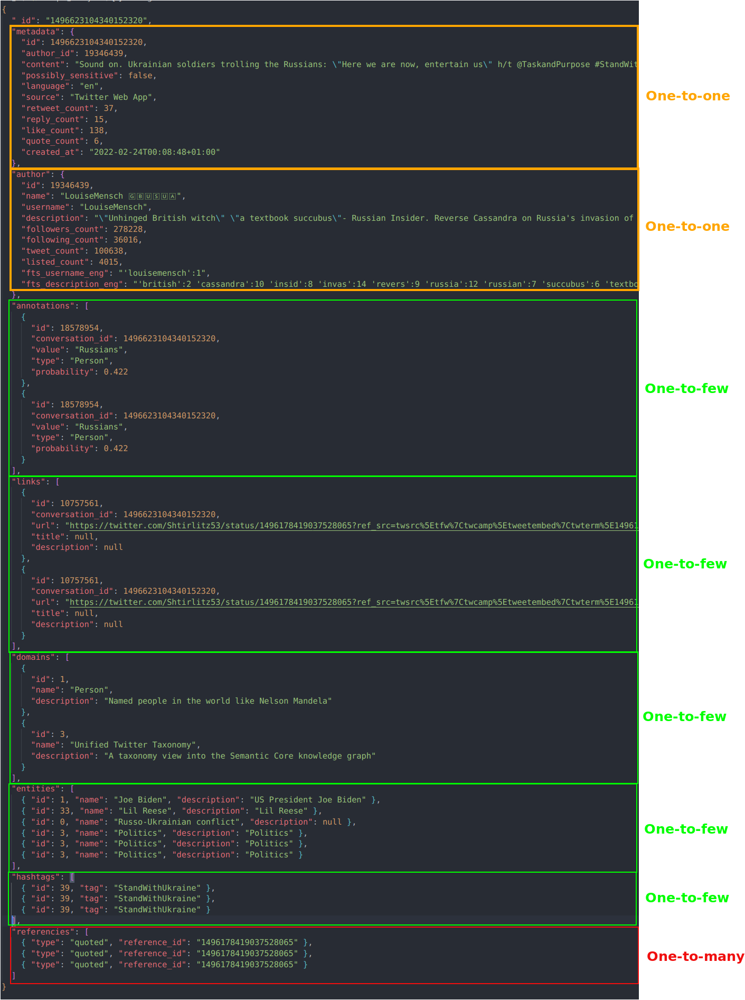
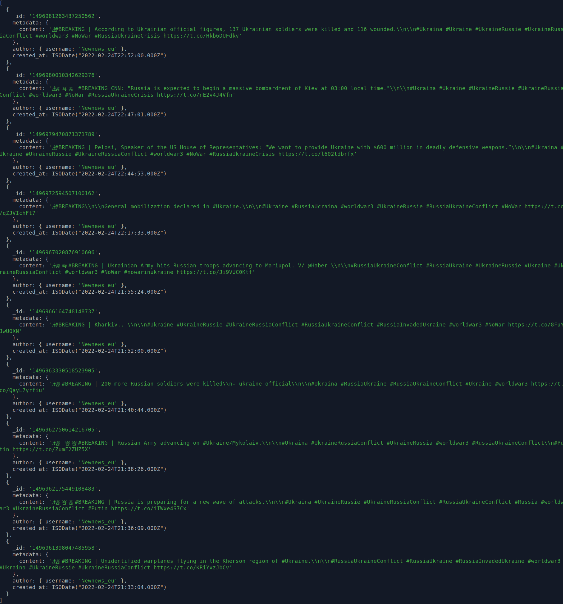
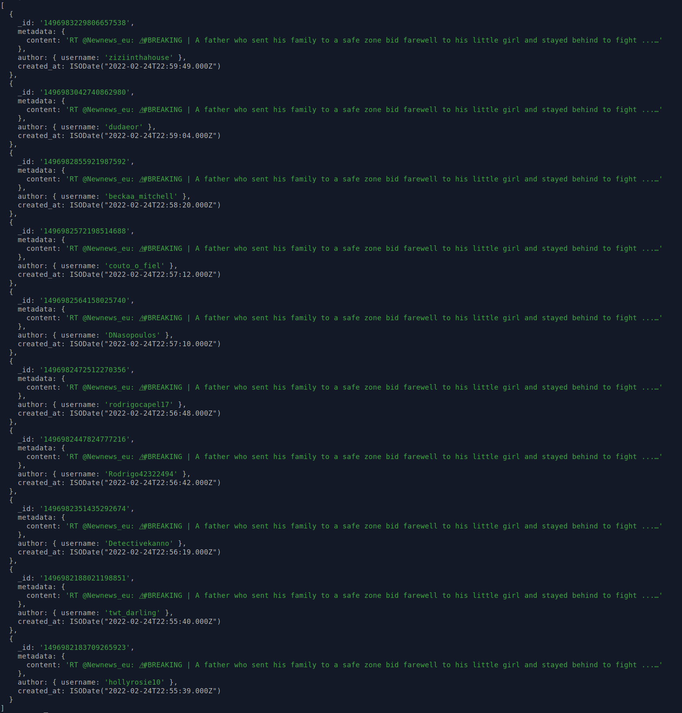

# Zadanie VI.

| Vypracoval: | Štefan Hajdú                                                   |
| ----------- | -------------------------------------------------------------- |
| GitHub:     | https://github.com/StefanHajdu/PDT-22/tree/master/Assignment_6 |

## Úloha 1:

Príklad dokumentu s vyznačenými vzťahmi:



Embedding:

- metadata
- author
- annotations
- links
- domains
- entities
- hashtags

Referencing:

- referencies

Dáta sme modelovali podla definovaných vzťahov z obrázku. Pre `metadata` a `author` je jednoznačne najlepší prístup embedding, pretože ide o vzťah 1:1.

Pri `annotations`, `links`, `domains`, `entities` a `hashtags` už situácia je trochu komplikovanejšia, keďže ide o vzťahy 1:n. Všetky by mohli byť uložené ako samostatné dokumenty, ktoré by boli spojené s tweetom ako referencia. My sme sa rozhodli ich uložiť priamo do hlavného dokumentu, lebo nepredpokladáme, že by tweet obsahoval 100-ky z každej triedy. Tieto vzťahy majú bližšie k 1:few ako 1:many, preto sme postupovali podľa best practices a uložili ich ako embeddings.

Pri `referencies` je situácia iná. Tu by už bolo veľmi pamäťovo neefktíne skladovať celé dokumenty. Preto ukladáme pre referencie iba typ referencie a id dokumentu, na ktorý sa odkazuje. Hoci aj tento vzťah spadá do kategórie 1:few je lepšie ho riešiť ako referencing. Obsah referencí vieme získať (ak by sme potrebovali) cez query:

```javascript
db.tweets_all.aggregate([
  {
    $lookup: {
      from: "tweets_all",
      localField: "_id",
      foreignField: "referencies.reference_id",
      as: "Full_Referencies",
    },
  },
]);
```

## Úloha 2:

Pre prácu s mongodb sme si pripravili prostredie v dockeri pomocou [návodu](https://hub.docker.com/_/mongo).

Kontajner sme si vytvorili podľa:

```console
docker pull mongo
docker run -i -p 27017:27017 -v /home/stephenx/Docker_Workspace/:/home --name mongodb mongo:latest
```

Spustenie MongoDB konzoli pre prácu s databázou:

```console
docker exec -it mongodb bash
mongosh
```

Ďalej sme zúžitkovali to, čo sme sa naučili o denormalizácii v zadaní 5. Teda:

1. vytvorili sme si denormalizovanú tabuľku, ktorá obsahuje JSON formát dokumentov
2. import skript len iteruje cez dopyt a posiela dáta do monga, žiaden parser tu nie je potrebný

### **Riešenie:**

1. Denormalizácia tabuliek:

   - conversations
   - authors
   - annotations
   - links
   - domains
   - entities
   - hashtags,

   v PostgreSQL pomocou query:

   ```sql
    create table z_4_mongo as -- 1840128
        select
            conversations.id,
            json_build_object(
                '_id',  (conversations.id)::text,
                'metadata', conversations,
                'author', authors,
                'annotations', annotations,
                'links', links,
                'domains', domains,
                'entities', entities,
                'hashtags', hashtags
            ) as tweet
        from
            conversations
        inner join
            authors
        on
            conversations.author_id = authors.id
        left join
            (
                select
                    conversations.id as conv_annot_id, json_agg(annotations) as annotations
                from
                    conversations
                left join
                    annotations
                on
                    conversations.id = annotations.conversation_id
                group by
                    conversations.id
            ) as conv_annot
        on
            conversations.id = conv_annot_id
        left join
            (
                select
                    conversations.id as conv_links_id, json_agg(links) as links
                from
                    conversations
                left join
                    links
                on
                    conversations.id = links.conversation_id
                group by
                    conversations.id
            ) as conv_links
        on
            conversations.id = conv_links_id
        left join
            (
                select
                    conversations.id as conv_domain_id, json_agg(context_domains) as domains
                from
                    conversations
                left join
                    context_annotations
                on
                    conversations.id = context_annotations.conversation_id
                left join
                    context_domains
                on
                    context_annotations.context_domain_id = context_domains.id
                group by
                    conversations.id
            ) as conv_domain
        on
            conversations.id = conv_domain_id
        left join
            (
                select
                    conversations.id as conv_entity_id, json_agg(context_entities) as entities
                from
                    conversations
                left join
                    context_annotations
                on
                    conversations.id = context_annotations.conversation_id
                left join
                    context_entities
                on
                    context_annotations.context_domain_id = context_entities.id
                group by
                    conversations.id
            ) as conv_entities
        on
            conversations.id = conv_entity_id
        left join
            (
                select
                    conversations.id as conv_tag_id, json_agg(hashtags) as hashtags
                from
                    conversations
                left join
                    conversation_hashtags
                on
                    conversations.id = conversation_hashtags.conversation_id
                left join
                    hashtags
                on
                    conversation_hashtags.hashtag_id = hashtags.id
                group by
                    conversations.id
            ) as conv_hash
        on
            conversations.id = conv_tag_id
        where conversations.created_at between '2022-02-24 00:00:00' and '2022-02-24 23:59:59';
   ```

   Výstupom je tabuľka, ktorá obsahuje iba údaje o tweetoch z dňa 24.02.2022 (1 840 128 riadkov).

2. Vloženie poľa referencii do dokumentov opať v PostreSQL. Tu vytvárame nový JSON objekt z JSON objektu vytvoreného vyššie, spojného s poľom referencií. Referencie si selectneme, tak že dostaneme 2 stĺpce: id tweetu a pole jeho referencií (tweetov na ktoré sa odkazuje). To potom môžeme joinnúť cez id s tabuľkou vytvorenou v predchádzajúcom query.

   Použité query:

   ```sql
    create table z_data_4_mongo as
        select
            z_4_mongo.id,
            json_build_object(
                '_id', (z_4_mongo.id)::text,
                'metadata', z_4_mongo.tweet->'metadata',
                'author', z_4_mongo.tweet->'author',
                'annotations', z_4_mongo.tweet->'annotations',
                'links', z_4_mongo.tweet->'links',
                'domains', z_4_mongo.tweet->'domains',
                'entities', z_4_mongo.tweet->'entities',
                'hashtags', z_4_mongo.tweet->'hashtags',
                'referencies', referencies
            ) as tweet
        from
            z_4_mongo
        left join
            (
                select
                    z_4_mongo.id as ref_id,
                    json_agg(
                        json_build_object(
                            'type', conversation_references.type,
                            'reference_id', (conversation_references.parent_id)::text
                        )
                    ) as referencies
                from
                    z_4_mongo
                left join
                    conversation_references
                on
                    conversation_references.conversation_id = z_4_mongo.id
                group by
                    z_4_mongo.id
            ) as refs
        on
            z_4_mongo.id = ref_id
   ```

   Výstupom je tabuľka, ktorá vo svojich riadkoch obsahuje konkrétne dokumenty, ktoré sa vložia do databázy.

3. Vytvorenie jednoduchého import skriptu `import_2_mongo.py`, ktorý sa pripojí na Postgres aj mongoDB server. A postupne číta tabuľku z_data_4_mongo po 100000 záznamoch, ktoré ako pole vkladá do monga. Implementované podľa návodu [JSON to MongoDB](https://www.mongodb.com/compatibility/json-to-mongodb).

## Úloha 3:

Vytvorené dotazy (vo výsledkoch vypisujeme iba autora, dátum, content):

1. **Vypíše posledných 10 tweetov pre autora, ktorý má username Newnews_eu**

   ```javascript
   db.tweets_all.aggregate([
     { $match: { "author.username": "Newnews_eu" } },
     {
       $project: {
         "author.username": 1,
         "metadata.content": 1,
         created_at: {
           $dateFromString: {
             dateString: "$metadata.created_at",
             format: "%Y-%m-%dT%H:%M:%S%z",
           },
         },
       },
     },
     { $sort: { created_at: -1 } },
     { $limit: 10 },
   ]);
   ```

   Výsledky:
   

2. **Vypíše posledných 10 retweetov pre tweet, ktorý má id 1496830803736731649**

   ```javascript
   db.tweets_all.aggregate([
     {
       $match: {
         // referencies v dokumente uvádzajú to na aký iný dokument sa odkazuje
         "referencies.reference_id": "1496830803736731649",
         "referencies.type": "retweeted",
       },
     },
     {
       $project: {
         "author.username": 1,
         "metadata.content": 1,
         created_at: {
           $dateFromString: {
             dateString: "$metadata.created_at",
             format: "%Y-%m-%dT%H:%M:%S%z",
           },
         },
       },
     },
     { $sort: { created_at: -1 } },
     { $limit: 10 },
   ]);
   ```

   Výsledky:
   
